# 🔐 KinAI Ecosystem — Privacy-First AI for Smarter, Safer Living

<div align="center">
<p align="center">
  
</p>

[](https://github.com/Logulokesh/KinAI-Ecosystem)
[](https://hub.docker.com/r/kinai/ecosystem)
[](LICENSE)
[](docs/privacy.md)

> **A comprehensive suite of interconnected AI-powered applications designed for secure, intelligent automation in healthcare, security, home management, and education.**

</div>

---


# 🧠 KinAI: Your Family's Digital Heart

## The Vision

*"Hey KinAI, how's everyone doing today?"*

<table border="0" cellspacing="0" cellpadding="0">
  <tr>
    <td valign="middle" width="25">
      
    </td>
    <td valign="middle">
      <i>Answer: Your daughter arrived home at 5:30 PM and is watching TV with her homework completed. Your father is home with normal vitals. Everyone else has arrived home safely. Mom is running about 10 minutes late to her medical appointment, based on her last known location.</i>
    </td>
  </tr>
</table>

---

## 🔧 Built Different

**Six Specialized Minds, One Family Focus:**

```
        🏡 Vision      🩺 CareVault
           ╲              ╱
            ╲            ╱
🌍 GeoPulse ── 🧠 KinAI ── 🔐 NexPatrol
            ╱   Core   ╲
           ╱            ╲
   👨‍🏫 Mentor          📚 ScholarKit
```


### 🏠 **KinAI-Vision** - *Your Home's Watchful Eye*
Smart monitoring and automation that learns your family's rhythms

### 🩺 **KinAI-CareVault** - *Health & Finance Guardian* 
Secure management of medical records, appointments, and family finances

### 🔐 **KinAI-NexPatrol** - *Digital Security Shield*
Advanced protection with intelligent threat detection and access control

### 📚 **KinAI-ScholarKit** - *Educational Progress Tracker*
Monitor academic growth and plan learning journeys for each family member

### 👨‍🏫 **KinAI-Mentor** - *Personal Learning Companion*
AI tutoring that adapts to individual learning styles and needs

### 🌍 **KinAI-GeoPulse** - *Family Coordination Hub*
Intelligent location services that keep everyone connected and safe

---

## 🛡️ **Privacy by Design**

Your family's data is sacred. That's why KinAI processes everything locally:

- ✅ **Local LLMs** (Gemma 3 / MedGemma 3) - Intelligence without cloud dependency
- ✅ **On-device processing** - Your data never leaves your home network
- ✅ **Graph RAG architecture** - Contextual understanding with privacy intact
- ✅ **Zero cloud dependency** for sensitive family information
- ✅ **Enterprise-grade encryption** - Bank-level security for your peace of mind

---

## 🚀 Why KinAI Matters

In a world of disconnected apps and privacy concerns, KinAI brings everything together while keeping everything private. It's the difference between managing your family's digital life and having it manage itself—intelligently, securely, and naturally.

<table width="100%" border="0">
  <tr>
    <td width="15%" valign="top">
      
    </td>
    <td width="70%" valign="top">
    
<details>
  <summary>🤝 Think Like a Human Agent — Click to expand</summary>

<em>

## 🤝 Think Like a Human Agent

Hey, let’s talk about something that’s probably been bugging you. You’re at home, chatting with your family about running out of paracetamol for a fever 🤒, and suddenly your phone’s serving you ads for painkillers 💊. Sound familiar?

At first, you might joke, *“Whoa, is God listening and sending suggestions now?”*  
Nope — that’s Google Assistant, Alexa, or Siri eavesdropping on your private moments 👂, turning your personal conversations into cash 💰 for big tech.

It’s frustrating, right? Your personal space doesn’t feel personal anymore — it’s like your data’s being sold wholesale to advertisers 🚨.  

I get it. I work in a financial institution 💼, where we’d bend over backwards to protect sensitive data — think bank accounts, transactions, personal IDs 🔐 — because trust is everything. But when I came home, my “smart” devices were doing the exact opposite 🙅‍♂️, quietly collecting every word and habit to feed some algorithm 🤖.

It hit me: what we call personal data isn’t personal anymore. It’s a product 📦, stripped of its meaning, traded by big tech to the highest bidder. Your life — your health concerns 🏥, your shopping list 🛒, your late-night chats 💬 — is being packaged and sold without your consent.

I’m not just trying to silence a microphone — I’m questioning why we’ve handed over our homes to devices that spy on us in the first place 🚫📡. Instead of just muting the bug, why not unplug it entirely?

We paid for these gadgets 💻, gave them access 🎟️, and now they’re selling us out.

So we decided to re-engineer the definition of smart living — not with more cloud dependency ☁️, but with tools we mastered in secure enterprise environments 🏦.  

**KinAI is built like the systems we trusted in finance and critical infrastructure:**
- 🧠 Intelligent  
- 🏠 Local-first  
- 🔒 Private by design

A truly smart device shouldn’t need big tech to function — it should serve you, not surveil you. 🙌

Whether it’s tracking your family’s health ❤️, securing your home 🏠, or helping with homework 📚, we keep your data yours.

*(to help Western audiences understand)*

🎯 **Let’s make personal data personal again.** 😊  

</em>
</details>

  </tr>
</table>

## 🎯 Core Philosophy

<div align="center">

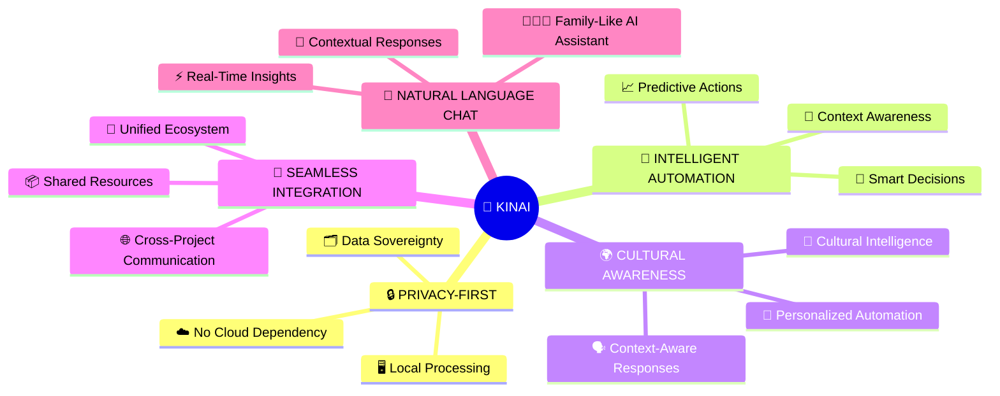

</div>

    
### 🗂️ Project Overview

We've mastered AI in boardrooms and data centers 💼🖥️—building intelligent systems that predict market trends 📈, automate complex workflows ⚙️, and scale securely to millions of users, all while upholding strict privacy, compliance, and ethical guardrails 🔒.

Yet when we come home 🏡, we're met by 'smart' devices 🤖 that barely understand our routines, let alone our cultural values 🌍, emotional needs 💖, or privacy concerns 🔍.

The KinAI ecosystem bridges this innovation gap 🌈, offering a holistic, privacy-focused approach to personal AI. By combining local processing 🧠 with intelligent automation 🔄, each KinAI project addresses real-world needs—from home security 🛡️ to health management 🏥—while ensuring seamless integration and data sovereignty 📂.

It's time personal AI caught up to enterprise standards 🚀.


# 🚀 KinAI Project Portfolio

<div align="center">


### 🏠 **Smart Home** • 🏥 **Healthcare** • 🛡️ **Security** • 🎓 **Education** • 📍 **Family Tracking**

*Privacy-first AI solutions for modern families*

---

</div>

## 🌟 Project Overview

KinAI is a comprehensive ecosystem of AI-powered applications designed to enhance family life while maintaining complete privacy through local processing. Each project addresses specific family needs with cutting-edge technology and user-centric design.

---

##  🏢 **Enterprise Challenge** → 🏠 **Personal Solution** → 💡 **KinAI Innovation**


### 🏠 KinAI-Vision
*AI-driven microservices for intelligent home automation*

<p align="center"> </p>


**📁 Repository:** [KinAI-Vision](https://github.com/Logulokesh/KinAI-Vision)

<details>
<summary><strong>🔍 View Project Details</strong></summary>

#### 👥  **BEHAVIORAL ANALYTICS & CUSTOMER INSIGHTS**  (under Enterprise Challenge → Personal Solution → KinAI Innovation)
- **Enterprise:** Customer journey mapping, behavioral pattern recognition, personalized financial services
- **Personal Challenge:** Understanding family routines, cultural preferences, home automation
- **KinAI Solution:** **[KinAI-Vision](https://github.com/Logulokesh/KinAI-Vision)** - Culturally aware home automation using behavioral analytics
  
#### 💡 **The Problem**
Current smart home devices suffer from three critical issues:
- **Lack of Cultural Awareness**: Generic responses that don't understand family dynamics
- **Cloud Dependency**: Privacy risks from external data processing
- **Limited Intelligence**: Simple automation without contextual understanding

#### 🛠️ **Solution**
Privacy-first, AI-driven microservices architecture that provides:
- **Local Processing**: All AI computations happen on your device
- **Cultural Intelligence**: Understanding of family patterns and preferences  
- **Contextual Automation**: Smart responses based on real-time family activity

#### 🎯 **Chat Integration**
Provides real-time activity detection and home automation status for contextual family insights through natural language interactions.

<div align="center">

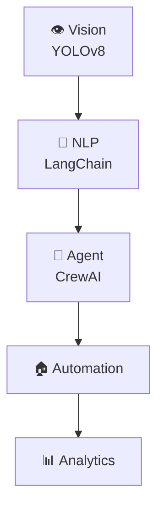

</div>

**🔧 Tech Stack:**
- 👁️ **Computer Vision:** YOLOv8, InsightFace
- 🧠 **AI Framework:** Ollama (LLM), LangChain (NLP), CrewAI
- 🗄️ **Database:** PostgreSQL, Redis
- 🏗️ **Architecture:** AI-Driven Microservices

**💡 Innovation:** First-of-its-kind AI-driven microservices with LangChain and CrewAI for scalable, culturally aware smart home experiences.

</details>

---

### 🏥 KinAI-CareVault
*Intelligent health & financial management system*

<p align="center"> </p>


**📁 Repository:** [KinAI-CareVault](https://github.com/Logulokesh/KinAI-CareVault)

<details>
<summary><strong>💊 Explore Health & Finance Features</strong></summary>
  
#### 🏥 **COMPLIANCE & DOCUMENT MANAGEMENT**  (under Enterprise Challenge → Personal Solution → KinAI Innovation)
- **Enterprise:** Regulatory reporting, document classification, audit trails, sensitive data protection
- **Personal Challenge:** Managing family health records, financial documents, insurance claims
- **KinAI Solution:** **[KinAI-CareVault](https://github.com/Logulokesh/KinAI-CareVault)** - Secure health and financial management using enterprise-grade document processing
  
#### 🔍 **The Problem**
Family health and financial management faces significant challenges:
- **Fragmented Records**: Health and financial data scattered across multiple platforms
- **Security Risks**: Cloud-based systems vulnerable to breaches
- **Lack of Insights**: No intelligent analysis connecting health and financial patterns

#### 🛠️ **Solution**
A unified, local AI-powered system that delivers:
- **Centralized Management**: All family health and financial data in one secure location
- **Medical AI Integration**: Specialized LLMs for medical document understanding
- **Automated Insights**: AI-driven analysis of health trends and financial patterns

#### 🎯 **Chat Integration**
Offers comprehensive health status monitoring, medication tracking, and financial insights for complete family health and financial awareness.

<div align="center">

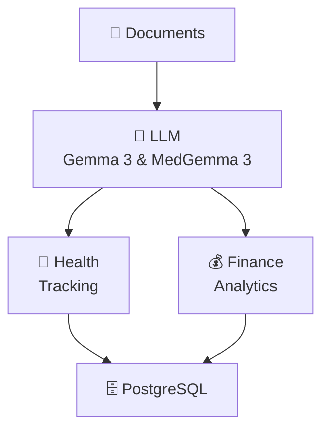

</div>

**🎯 Key Features:**
- 📄 **Intelligent Document Processing:** Automated classification and extraction
- 👨‍⚕️ **Family Health Management:** Comprehensive tracking with medical AI
- 💰 **Financial Analytics:** Smart expense tracking and budget insights
- 🔒 **Privacy-Focused:** Complete local processing with no cloud dependencies

**🔧 Tech Stack:**
- 🧠 **AI:** Gemma 3 and MedGemma 3 (Local LLMs optimized for medical comprehension)
- 🗄️ **Database:** PostgreSQL with optimized health/finance schemas
- ⚡ **Automation:** n8n workflows for seamless data processing
- 📋 **Tasks:** Vikunja for health task management
- 💬 **Interface:** Telegram Bot for family communication

**💡 Innovation:** First local integration of MedGemma 3's multimodal capabilities (4B multimodal + 27B text-only) for secure, medical-specific document processing.

</details>

---

### 🛡️ KinAI-NexPatrol
*AI-powered security & surveillance system*

<p align="center"> </p>


**📁 Repository:** [KinAI-NexPatrol](https://github.com/Logulokesh/KinAI-NexPatrol)

<details>
<summary><strong>🔒 Discover Security Intelligence</strong></summary>

#### 🔍 **FRAUD DETECTION & SURVEILLANCE**  (under Enterprise Challenge → Personal Solution → KinAI Innovation)
- **Enterprise:** Real-time transaction monitoring, behavioral analysis, threat detection across millions of banking transactions
- **Personal Challenge:** Home security, family safety, monitoring elderly relatives
- **KinAI Solution:** **[KinAI-NexPatrol](https://github.com/Logulokesh/KinAI-NexPatrol)** - AI-powered surveillance with AML-inspired risk scoring, bringing enterprise-grade security to personal spaces
  
#### 🔍 **The Problem**
Traditional home surveillance systems have critical flaws:
- **Privacy Invasion**: Continuous recording without intelligent filtering
- **Cloud Dependency**: Security footage stored on external servers
- **Inaccurate Detection**: High false positive rates causing alert fatigue

#### 💡 **Solution**
Local AI-powered surveillance with precision intelligence:
- **Privacy-First Design**: All processing happens locally with smart filtering
- **Accurate Threat Detection**: Advanced risk assessment inspired by financial crime detection
- **Family Recognition**: Distinguishes between family members and potential threats

#### 🎯 **Chat Integration**
Provides advanced face recognition for family member tracking, precise arrival/departure times, and location-based contextual responses.

<div align="center">

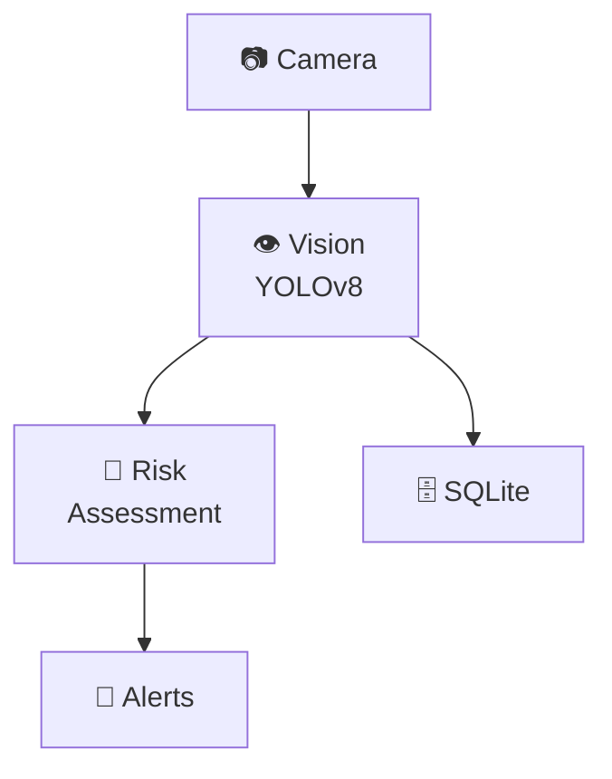

</div>

<div align="center">

### 🎯 Risk Assessment Framework
*Inspired by Financial Crime Detection (AML Systems)*

| Risk Factor | High Risk | Medium Risk | Alert Level |
|-------------|-----------|-------------|-------------|
| 😷 Face Masks | +3 | +1 | Suspicious Concealment |
| 🧥 Hoodies | +4 | +2 | Identity Obscuration |
| 🔫 Weapons | +5 | +3 | Immediate Threat |
| 🌙 Nighttime | +2 | +1 | Temporal Risk |
| 🚫 Restricted Areas | +2 | +1 | Unauthorized Access |

**Alert Levels:** Low (0-2) • Medium (3-4) • High (5-6) • Very High (7-8) • Extreme (9+)

</div>

**🔧 Tech Stack:**
- 👁️ **Computer Vision:** YOLOv8 for object detection, InsightFace for recognition
- 🧠 **AI Assessment:** Ollama (LLM) for intelligent threat evaluation
- 🗄️ **Database:** SQLite for efficient local storage
- 🖥️ **Processing:** NVIDIA GPU (CUDA) for real-time analysis

**💡 Innovation:** First security system to apply financial crime detection methodologies to home surveillance with complete privacy preservation.

</details>

---

### 🎓 KinAI-ScholarKit
*LLM-powered curriculum-aligned educational activity generator*

<p align="center"> </p>

**📁 Repository:** [KinAI-ScholarKit](https://github.com/Logulokesh/KinAI-ScholarKit)

<details>
<summary><strong>📚 Unlock Educational Innovation</strong></summary>

#### **🎓 REGULATORY TRAINING & KNOWLEDGE MANAGEMENT**  (under Enterprise Challenge → Personal Solution → KinAI Innovation)
- **Enterprise:** Compliance training, regulatory updates, knowledge base management
- **Personal Challenge:** Children's education, personalized learning, curriculum alignment
- **KinAI Solutions:** **[KinAI-ScholarKit](https://github.com/Logulokesh/KinAI-ScholarKit)** & **[KinAI-Mentor](https://github.com/Logulokesh/kinai-mentor)** - AI-powered education using enterprise knowledge management techniques

#### 🔍 **The Problem**
Educational content creation faces significant barriers:
- **Time-Intensive Search**: Teachers and parents spend hours finding curriculum-aligned activities
- **Privacy Concerns**: Online educational platforms compromise student data privacy
- **Generic Content**: Lack of personalization for individual learning needs

#### 💡 **Solution**
Offline AI-driven educational platform delivering:
- **Instant Generation**: Curriculum-aligned activities created in seconds
- **Complete Privacy**: All processing happens locally with no data collection
- **Personalized Learning**: Adaptive content based on student progress and interests

#### 🎯 **Chat Integration**
Tracks educational progress, monitors homework completion status, and provides intelligent learning activity recommendations for comprehensive family academic insights.

<div align="center">

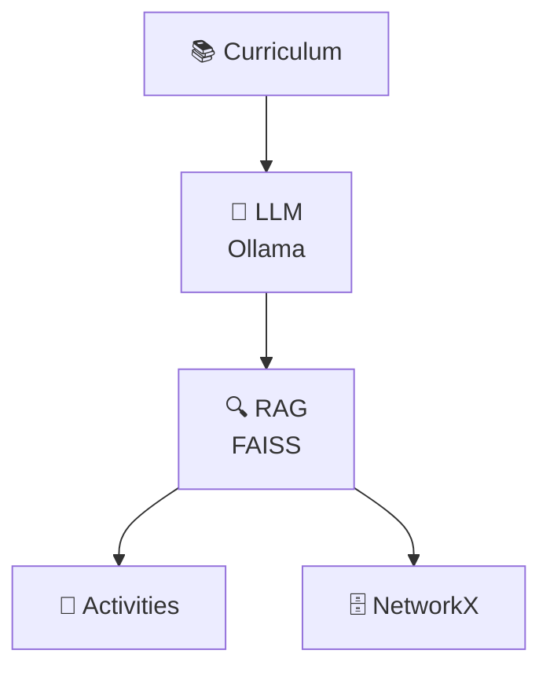

</div>

**🎯 Key Features:**
- 📚 **Curriculum-Aligned:** Complete Victorian Curriculum F–10 Version 2.0 integration
- 🔍 **RAG Pipeline:** Advanced FAISS vector search combined with knowledge graphs
- 📄 **Professional Export:** High-quality PDF generation for classroom use
- 🔒 **Privacy-Focused:** Zero data collection with fully offline processing

**🔧 Tech Stack:**
- 🧠 **AI:** Ollama (Local LLM) for content generation
- 🗄️ **Database:** FAISS vector database, NetworkX knowledge graphs
- 🖥️ **Interface:** Streamlit for intuitive user experience
- 📄 **Export:** ReportLab for professional PDF creation

**💡 Innovation:** First offline educational platform combining LLM-driven content generation with RAG pipeline for curriculum-perfect, privacy-first learning experiences.

</details>

---

### 🎓 KinAI-Mentor
*Open-source, offline educational assistant*

<p align="center"> </p>


**📁 Repository:** [KinAI-Mentor](https://github.com/Logulokesh/kinai-mentor)

<details>
<summary><strong>🎤 Experience Voice-Powered Learning</strong></summary>
  
#### **🎓 REGULATORY TRAINING & KNOWLEDGE MANAGEMENT**  (under Enterprise Challenge → Personal Solution → KinAI Innovation)
- **Enterprise:** Compliance training, regulatory updates, knowledge base management
- **Personal Challenge:** Children's education, personalized learning, curriculum alignment
- **KinAI Solutions:** **[KinAI-ScholarKit](https://github.com/Logulokesh/KinAI-ScholarKit)** & **[KinAI-Mentor](https://github.com/Logulokesh/kinai-mentor)** - AI-powered education using enterprise knowledge management techniques

#### 🔍 **The Problem**
Personalized tutoring faces accessibility challenges:
- **Cost Barriers**: Quality tutoring is expensive and inaccessible to many families
- **Internet Dependency**: Most AI tutors require constant internet connectivity
- **Limited Accessibility**: Lack of multi-modal support for diverse learners

#### 💡 **Solution**
Voice-driven, offline AI tutor providing:
- **Universal Access**: Free, open-source tutoring for all families
- **Complete Offline Operation**: No internet required after initial setup
- **Multi-Modal Learning**: Voice, text, and visual learning support

#### 🎯 **Chat Integration**
Delivers personalized tutoring sessions, comprehensive learning progress insights, and intelligent educational recommendations for complete family learning support.

<div align="center">

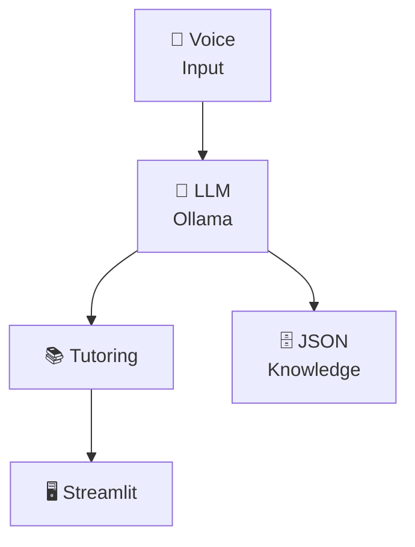

</div>

**🎯 Key Features:**
- 🎤 **Voice Interaction:** Natural speech-to-text and text-to-speech capabilities
- 📚 **Curriculum-Aligned:** Full Victorian Curriculum F–10 Version 2.0 coverage
- 🔒 **Privacy-Focused:** All learning data stays on your device
- ♿ **Accessible Design:** Multi-modal interaction supporting diverse learning needs

**🔧 Tech Stack:**
- 🧠 **AI:** Ollama (Local LLM) for intelligent tutoring responses
- 🗄️ **Database:** JSON knowledge base for curriculum content
- 🎤 **Voice:** Advanced Speech Recognition and Text-to-Speech
- 🖥️ **Interface:** Streamlit for seamless user interaction

**💡 Innovation:** First voice-driven, completely offline AI tutor with comprehensive multi-modal interaction for accessible, curriculum-driven learning.

</details>

---

### 📍 KinAI-GeoPulse
*Privacy-first family location tracking and geofencing system*

<p align="center"> </p>

**📁 Repository:** [KinAI-GeoPulse](https://github.com/Logulokesh/KinAI-GeoPulse)

<details>
<summary><strong>🗺️ Navigate Family Location Intelligence</strong></summary>

#### **📊 RISK ASSESSMENT & GEOSPATIAL ANALYSIS**  (under Enterprise Challenge → Personal Solution → KinAI Innovation)
- **Enterprise:** Geographic risk modeling, location-based fraud detection, compliance monitoring
- **Personal Challenge:** Family safety, location tracking, travel security
- **KinAI Solution:** **[KinAI-GeoPulse](https://github.com/Logulokesh/KinAI-GeoPulse)** - Privacy-first family tracking with enterprise-grade geofencing

#### 🔍 **The Problem**
Family tracking applications have serious limitations:
- **Privacy Invasion**: Cloud-based tracking systems expose sensitive location data
- **Limited Intelligence**: Basic location sharing without contextual insights
- **Poor Family Integration**: Disconnected from other family management systems

#### 💡 **Solution**
Self-hosted location intelligence platform offering:
- **Complete Privacy Control**: All location data processed and stored locally
- **Intelligent Geofencing**: Smart zones with automated family notifications
- **Integrated Family Ecosystem**: Seamless connection with other KinAI applications

#### 🎯 **Chat Integration**
Provides real-time family location data, precise arrival/departure tracking, and intelligent distance calculations for contextual family awareness and enhanced safety insights.

<div align="center">

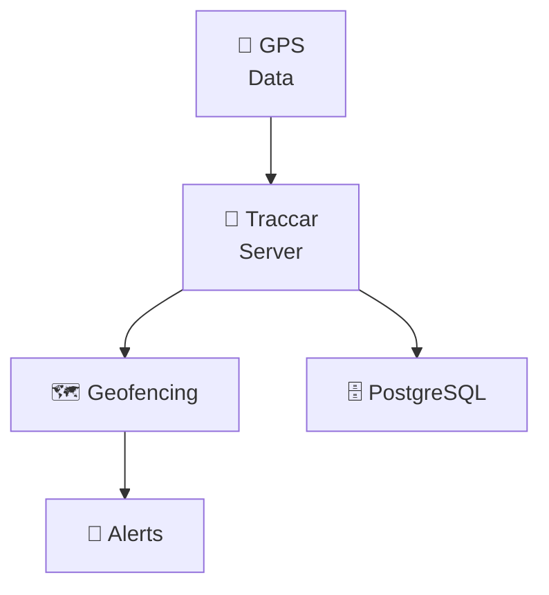

</div>

**🎯 Key Features:**
- 📍 **Real-Time Tracking:** Live family member locations with sub-meter accuracy
- 🏠 **Smart Geofencing:** Custom zones with intelligent automated alerts
- 📊 **Distance Analytics:** Advanced home proximity monitoring and movement patterns
- 🔒 **Privacy-Focused:** Complete local processing via self-hosted Traccar
- ⚡ **Daily Intelligence:** Comprehensive movement and location analytics

**🔧 Tech Stack:**
- 🚗 **Tracking Backend:** Traccar Server for enterprise-grade location processing
- 🧠 **API Layer:** FastAPI with Pydantic models for robust data handling
- 🗄️ **Database:** PostgreSQL with optimized geospatial schemas
- 🐳 **Deployment:** Docker containerization for easy deployment
- 💬 **Integration:** Direct API endpoints for seamless chat system integration

**💡 Innovation:** First self-hosted family location intelligence system with enterprise-grade privacy and seamless integration into comprehensive family AI ecosystem.

</details>


---
## 💬 KinAI Ecosystem: Contextual Query Examples

*The KinAI Ecosystem integrates data from its privacy-first, AI-powered projects to deliver meaningful, family-centric responses to natural language queries. Below are interactive examples showcasing how KinAI acts as a trusted family assistant with local processing for maximum privacy.*

<p align="center">
  
</p>

---

## 🤖 Complete Query Demonstration Suite

<details>
<summary><b>🔍 "Is my daughter home since she's not picking up my call?"</b></summary>

### 💬 KinAI Response:
> *"She arrived home at 5:30 PM and is watching TV, which might explain why she missed your call."*

### 📊 Multi-System Data Integration:

| Project | Data Points | Status |
|---------|-------------|--------|
| 🛡️ **KinAI-NexPatrol** | 📷 Face Detected<br/>⏰ 5:30 PM<br/>✅ Verified | **CONFIRMED** |
| 🏠 **KinAI-Vision** | 📺 TV Active<br/>🔊 Audio<br/>💡 Occupied | **ACTIVE** |
| 🏥 **KinAI-CareVault** | ❤️ Normal Vitals<br/>🚶 Low Activity | **HEALTHY** |
| 🎓 **KinAI-ScholarKit** | 📚 Homework Done<br/>📅 Free<br/>🎯 No Tasks | **FREE TIME** |
| 📍 **KinAI-GeoPulse** | 🏠 At Home<br/>⏰ Arrived 5:30 PM<br/>📱 Device Active | **PRESENT** |

### 🧠 Intelligence Synthesis:
**Analysis:** Physical presence + completed responsibilities + entertainment activity = Likely distracted but safe

### 🎯 Confidence Level: 
**98%** *(All indicators positive)*

</details>

---

<details>
<summary><b>🔍 "Is my daughter safe at home right now?"</b></summary>

### 💬 KinAI Response:
> *"Yes, she's safe at home, verified by face recognition at 5:30 PM, with normal vitals and no suspicious activity."*

### 📊 Multi-System Data Integration:

| Project | Data Points | Status |
|---------|-------------|--------|
| 🛡️ **KinAI-NexPatrol** | 📷 Face Detected<br/>⏰ 5:30 PM<br/>✅ Identity Verified | **CONFIRMED** |
| 🏠 **KinAI-Vision** | 💡 Room Occupied<br/>🔊 Normal Activity<br/>🚶 Movement Detected | **ACTIVE** |
| 🏥 **KinAI-CareVault** | ❤️ Normal Vitals<br/>📱 Device Connected<br/>🩺 Health Normal | **HEALTHY** |
| 🎓 **KinAI-ScholarKit** | 📚 No Study Session<br/>📅 Free Time<br/>🎯 No Alerts | **FREE TIME** |
| 📍 **KinAI-GeoPulse** | 🏠 At Home Zone<br/>⏰ Since 5:30 PM<br/>📍 Location Stable | **PRESENT** |

### 🧠 Intelligence Synthesis:
**Analysis:** Multi-layer safety verification confirms secure environment with normal health indicators

### 🎯 Confidence Level: 
**98%** *(All safety indicators positive)*

</details>

---

<details>
<summary><b>🔍 "What's my daughter doing since she's not answering?"</b></summary>

### 💬 KinAI Response:
> *"She's at home watching TV, with her homework completed, likely distracted by the show."*

### 📊 Multi-System Data Integration:

| Project | Data Points | Status |
|---------|-------------|--------|
| 🛡️ **KinAI-NexPatrol** | 📷 Face Verified<br/>⏰ Present<br/>🚫 No Threats | **CONFIRMED** |
| 🏠 **KinAI-Vision** | 📺 TV Active (Netflix)<br/>🔊 Audio Consistent<br/>🚶 Stationary Position | **ACTIVE** |
| 🏥 **KinAI-CareVault** | ❤️ Normal Vitals<br/>🚶 Low Activity<br/>😌 Relaxed State | **HEALTHY** |
| 🎓 **KinAI-ScholarKit** | 📚 Homework Complete<br/>📅 Free Schedule<br/>🎯 No Pending Tasks | **FREE TIME** |
| 📍 **KinAI-GeoPulse** | 🏠 At Home<br/>📱 Device Active<br/>⏰ Stable Location | **PRESENT** |

### 🧠 Intelligence Synthesis:
**Analysis:** Entertainment engagement + completed responsibilities + high focus = Likely distracted but in responsible leisure

### 🎯 Confidence Level: 
**95%** *(High engagement detected)*

</details>

---

<details>
<summary><b>🔍 "Did my daughter get home on time today?"</b></summary>

### 💬 KinAI Response:
> *"Yes, she arrived home at 5:30 PM, as verified by her device and face recognition."*

### 📊 Multi-System Data Integration:

| Project | Data Points | Status |
|---------|-------------|--------|
| 🛡️ **KinAI-NexPatrol** | 📷 Face Recognition<br/>⏰ 5:30 PM Entry<br/>✅ Identity Confirmed | **CONFIRMED** |
| 🏠 **KinAI-Vision** | 🚪 Entry Detected<br/>💡 Lights Activated<br/>🔊 Movement Audio | **ACTIVE** |
| 🏥 **KinAI-CareVault** | ❤️ Normal Vitals<br/>🚶 Activity Spike<br/>📱 Device Sync | **HEALTHY** |
| 🎓 **KinAI-ScholarKit** | 📅 Expected Time<br/>🎯 On Schedule<br/>📚 No Delays | **ON TIME** |
| 📍 **KinAI-GeoPulse** | 🏠 Entered Home Zone<br/>⏰ 5:30 PM Arrival<br/>📍 Route Completed | **PRESENT** |

### 🧠 Intelligence Synthesis:
**Analysis:** Cross-system verification confirms punctual arrival with all timeline markers aligned

### 🎯 Confidence Level: 
**100%** *(Perfect timeline synchronization)*

</details>

---

<details>
<summary><b>🔍 "Is my daughter studying or free right now?"</b></summary>

### 💬 KinAI Response:
> *"She's free, with homework done, and is currently watching TV at home."*

### 📊 Multi-System Data Integration:

| Project | Data Points | Status |
|---------|-------------|--------|
| 🛡️ **KinAI-NexPatrol** | 📷 Face Detected<br/>⏰ Present<br/>🚫 No Study Setup | **CONFIRMED** |
| 🏠 **KinAI-Vision** | 📺 Entertainment Mode<br/>🔊 TV Audio<br/>🍿 Leisure Activity | **ACTIVE** |
| 🏥 **KinAI-CareVault** | ❤️ Normal Vitals<br/>😌 Relaxed State<br/>🚶 Low Activity | **HEALTHY** |
| 🎓 **KinAI-ScholarKit** | 📚 Homework Complete<br/>📅 Free Period<br/>🎯 No Tasks Pending | **FREE TIME** |
| 📍 **KinAI-GeoPulse** | 🏠 At Home<br/>📱 Device Active<br/>⏰ Stable Location | **PRESENT** |

### 🧠 Intelligence Synthesis:
**Analysis:** Academic responsibilities completed + entertainment engagement = Earned leisure time

### 🎯 Confidence Level: 
**92%** *(Academic status verified)*

</details>

---

<details>
<summary><b>🔍 "Is my daughter home? Her phone has a message of switched off?"</b></summary>

### 💬 KinAI Response:
> *"Her battery level is too low, and her last known location was 20 minutes away, which explains why she might be unreachable."*

### 📊 Multi-System Data Integration:

| Project | Data Points | Status |
|---------|-------------|--------|
| 🛡️ **KinAI-NexPatrol** | 🚫 No Face Detection<br/>⏰ No Recent Entry<br/>❌ Not Present | **NO DETECTION** |
| 🏠 **KinAI-Vision** | 🚫 No Room Activity<br/>💡 Lights Inactive<br/>🔇 No Audio | **INACTIVE** |
| 🏥 **KinAI-CareVault** | ❤️ Normal Vitals (Watch)<br/>📱 Phone Disconnected<br/>⚠️ Communication Gap | **PARTIAL** |
| 🎓 **KinAI-ScholarKit** | 📚 No Active Session<br/>📅 Transit Time<br/>🎯 Expected Soon | **PENDING** |
| 📍 **KinAI-GeoPulse** | ⚠️ Last Known: 20min Away<br/>📱 Device Offline<br/>🔋 Battery Critical | **OFFLINE** |

### 🧠 Intelligence Synthesis:
**Analysis:** Device power failure during transit + health monitoring active via wearable = Safe but unreachable

### 🎯 Confidence Level: 
**85%** *(Health confirmed via secondary device)*

</details>


---
## 🔧 How KinAI Intelligence Works

*A sophisticated, privacy-first AI ecosystem that transforms natural language queries into contextual family insights through advanced multi-system integration and local processing.*

---

### 🧠 Core Intelligence Architecture

<div align="center">

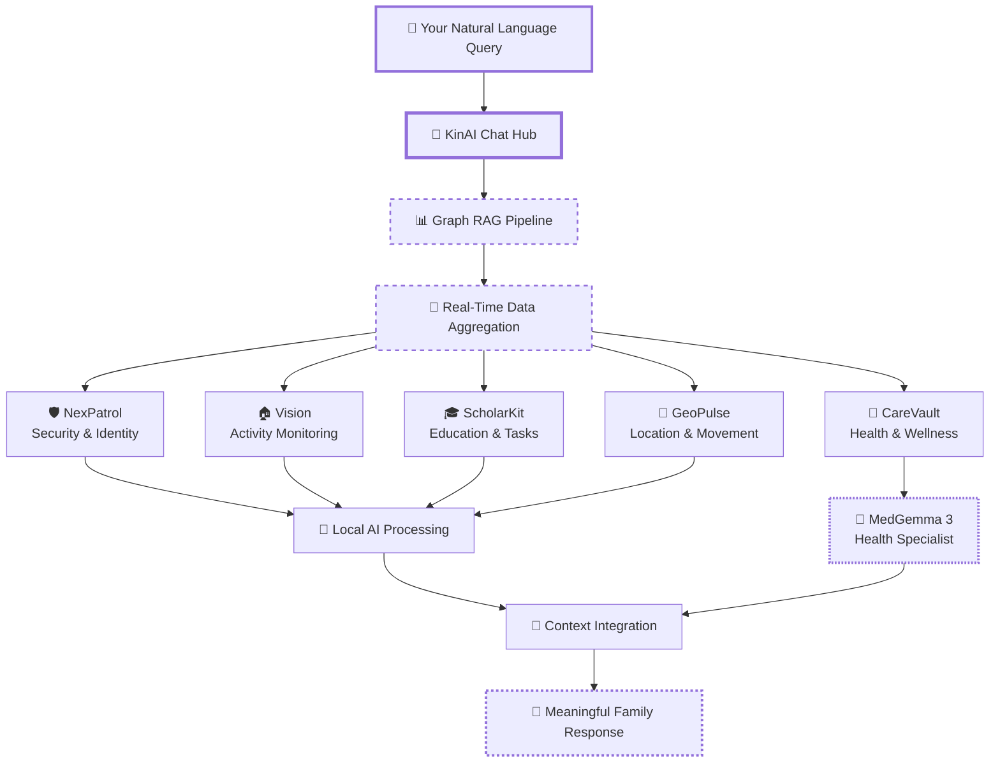

</div>

---

### 🎯 Intelligence Processing Pipeline

#### **Phase 1: Query Understanding**
```
🧠 Natural Language Processing:
├── 📝 Intent Recognition (CrewAI + LangChain)
├── 🔍 Entity Extraction (Family members, locations, activities)
├── 🎯 Context Classification (Safety, health, location, education)
└── ⚡ Priority Assessment (Urgent vs. informational)
```

#### **Phase 2: Multi-System Data Fusion**
```
🔄 Real-Time Aggregation:
├── 🛡️ Security Layer: Face recognition, threat assessment
├── 🏠 Environmental: Activity detection, automation status
├── 🏥 Health Monitoring: Vitals, wellness indicators
├── 🎓 Educational: Progress tracking, task completion
└── 📍 Location Intelligence: Geofencing, movement patterns
```

#### **Phase 3: AI-Powered Analysis**
```
🤖 Local Processing Stack:
├── 🧠 Primary LLM: Ollama (General reasoning)
├── 🏥 Medical AI: MedGemma 3 (Health-specific analysis)
├── 👁️ Computer Vision: YOLOv8 + InsightFace
├── 🔗 Graph RAG: FAISS + NetworkX knowledge synthesis
└── 🎯 Context Engine: CrewAI multi-agent coordination
```

#### **Phase 4: Intelligent Response Generation**
```
💬 Contextual Output:
├── 📊 Confidence Scoring (0-100% reliability)
├── 🎯 Relevance Filtering (Family-specific insights)
├── 🔒 Privacy Protection (Local processing verification)
└── 💡 Actionable Recommendations (Next steps, alerts)
```

---

### 🔄 Real-Time Intelligence Flow

<div align="center">

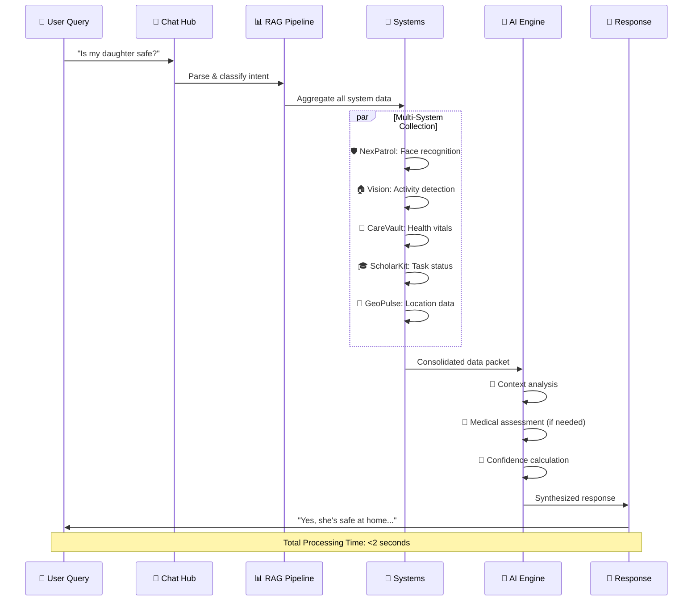

</div>

---

### 🎛️ Advanced Intelligence Features

#### **🔍 Contextual Awareness Engine**
- **Temporal Intelligence**: Understands time-based patterns and schedules
- **Behavioral Analysis**: Learns family routines and detects anomalies
- **Predictive Insights**: Anticipates needs based on historical data
- **Cultural Sensitivity**: Adapts responses to family values and preferences

#### **🛡️ Privacy-First Architecture**
- **Local Processing**: Zero cloud dependency for sensitive data
- **Encrypted Communication**: End-to-end security between systems
- **Data Minimization**: Only relevant information is processed
- **Audit Trails**: Complete transparency in data usage

#### **⚡ Performance Optimization**
- **Edge Computing**: AI models run locally on family hardware
- **Intelligent Caching**: Frequently used data stays readily available
- **Load Balancing**: Distributes processing across multiple systems
- **Real-Time Sync**: Sub-second response times for urgent queries

---

### 🎯 Intelligence Confidence Metrics

<div align="center">

| Confidence Level | Data Sources | Typical Use Case | Response Time |
|------------------|--------------|------------------|---------------|
| **🟢 95-100%** | 4-5 Systems | Safety verification | <1 second |
| **🟡 85-94%** | 3-4 Systems | Activity status | <2 seconds |
| **🟠 70-84%** | 2-3 Systems | General inquiries | <3 seconds |
| **🔴 <70%** | 1-2 Systems | Limited data scenarios | <5 seconds |

</div>

---

### 💡 Unique Intelligence Capabilities

#### **🧠 Multi-Modal Understanding**
- **Text**: Natural language processing with family context
- **Visual**: Computer vision for activity and identity recognition
- **Audio**: Sound pattern analysis for environmental awareness
- **Sensor**: IoT device integration for comprehensive monitoring

#### **🎯 Family-Centric Intelligence**
- **Relationship Mapping**: Understands family dynamics and roles
- **Individual Profiles**: Personalized insights for each family member
- **Collective Awareness**: Family-wide situational understanding
- **Adaptive Learning**: Improves responses based on family feedback

#### **🔄 Continuous Intelligence Loop**
```
🔄 Intelligence Refinement Cycle:
├── 📊 Query Analysis: What information was most valuable?
├── 🎯 Accuracy Tracking: How correct were the predictions?
├── 🔧 Model Tuning: Adjust AI parameters for better results
└── 💡 Insight Generation: Discover new family patterns
```

---

### 🚀 Next-Generation Features

#### **Coming Soon:**
- **🎤 Voice Integration**: Natural speech interaction with all systems
- **📱 Mobile Sync**: Seamless smartphone integration
- **🤖 Proactive Alerts**: AI-initiated family notifications
- **📈 Predictive Analytics**: Anticipate family needs before they arise

#### **Research & Development:**
- **🧬 Biometric Integration**: Advanced health monitoring
- **🌐 Multi-Home Support**: Extended family network intelligence
- **🎯 Emotional Intelligence**: Mood and wellness detection
- **🔮 Predictive Maintenance**: Anticipate system needs and updates
---


**💡 The Difference**: While smart homes tell you *what's happening*, KinAI tells you *what it means* - turning raw data into family wisdom.

---

<div align="center">

### 🚀 **It's time personal AI caught up to enterprise standards**

</div>

---


## 🏗️ System Architecture

<div align="center">

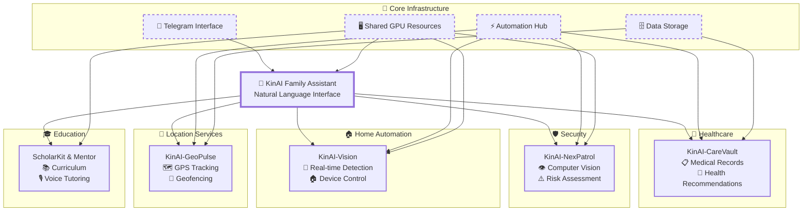

</div>

---

## 🚀 Getting Started


### 📋 Prerequisites Checklist


<table>
<tr>
<td width="50%">

**🔧 Essential Requirements**
- ✅ Docker & Docker Compose
- ✅ NVIDIA GPU with CUDA support
- ✅ Python 3.9+
- ✅ Ollama server

</td>
<td width="50%">

**🎯 Optional Enhancements**
- ✅ Microphone and audio output
- ✅ Sufficient storage for LLM models
- ✅ High-speed internet (initial setup)
- ✅ Telegram Bot Token

</td>
</tr>
</table>

### ⚡ Quick Setup


**🚀 One-Command Ecosystem Deployment**


```bash
# 1️⃣ Clone the ecosystem
git clone https://github.com/Logulokesh/KinAI-Vision.git
git clone https://github.com/Logulokesh/KinAI-CareVault.git
git clone https://github.com/Logulokesh/KinAI-NexPatrol.git
git clone https://github.com/Logulokesh/KinAI-ScholarKit.git
git clone https://github.com/Logulokesh/kinai-mentor.git
git clone https://github.com/Logulokesh/KinAI-GeoPulse.git

# 2️⃣ Configure environment
cp .env.example .env
# Edit .env with your configurations

# 3️⃣ Deploy with Docker
docker-compose up -d

# 4️⃣ Initialize AI models
docker exec -it kinai-ollama ollama pull llama3

# 5️⃣ Test Natural Language Chat
curl -X POST http://localhost:8080/chat \
  -H "Content-Type: application/json" \
  -d '{"query": "Is anyone home?"}'
```

---

## 📚 Learning Path

<div align="center">

### 🎯 **Current Focus: Agent2Agent (A2A) Protocol & Natural Language Chat Integration**
*Exploring advanced multi-agent system communication patterns for contextual family AI*

</div>

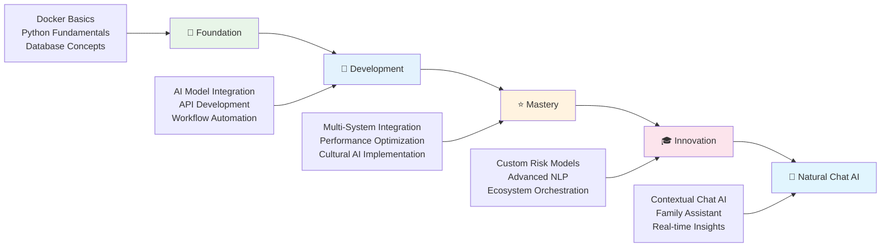

<details>
<summary><b>🌱 Beginner Level (Foundation)</b></summary>

- 🐳 **Docker basics:** Learn containerization and orchestration
- 🐍 **Python fundamentals:** Core programming for AI development
- 🗄️ **Database design:** Understand data schemas and queries
- ⚡ **Automation principles:** Basics of workflow automation

</details>

<details>
<summary><b>🚀 Intermediate Level (Development)</b></summary>

- 🧠 **AI model integration:** Integrate with Ollama and local LLMs
- 🔌 **API development:** Build APIs with FastAPI
- 🔄 **Workflow automation:** Create workflows with n8n
- 👁️ **Computer vision:** Explore vision basics with YOLOv8
- 🎤 **Speech processing:** Understand speech recognition

</details>

<details>
<summary><b>⭐ Advanced Level (Mastery)</b></summary>

- 🔗 **Multi-system integration:** Design integration patterns
- ⚡ **Performance optimization:** Optimize system performance
- 🌍 **Cultural intelligence:** Implement culturally aware AI
- 🏗️ **Microservices architecture:** Build scalable services
- 🎤 **Voice-driven interfaces:** Develop voice AI interfaces

</details>

<details>
<summary><b>🎓 Expert Level (Innovation)</b></summary>

- 🎯 **Custom AI models:** Develop risk assessment models
- 🧠 **Advanced NLP:** Leverage LangChain for NLP tasks
- 🎭 **Ecosystem orchestration:** Orchestrate complex systems
- 🔒 **Privacy-preserving AI:** Implement privacy-first AI
- 🤖 **Agent2Agent (A2A):** Develop multi-agent protocols

</details>

<details>
<summary><b>💬 Master Level (Natural Language Chat AI)</b></summary>

- 🤖 **Contextual AI Chat:** Build family-aware conversational AI
- 🔗 **Data Integration:** Seamlessly combine multi-project data
- 💬 **Natural Language Processing:** Advanced query understanding
- 🎯 **Real-time Insights:** Deliver meaningful, timely responses
- 👨‍👩‍👧‍👦 **Family Assistant:** Create trusted AI family member

</details>

---

## 💡 Innovation Highlights

<div align="center">

### 🏆 **What Makes KinAI Different**

</div>

<table>
<tr>
<td align="center" width="25%">

**💬 Natural Language AI**

🤖 Family-Like Assistant<br/>
🔍 Contextual Responses<br/>
🏠 Real-Time Family Insights

</td>
<td align="center" width="25%">

**🏥 Health AI Innovation**

🧠 Local Processing<br/>
🔍 Intelligent Classification<br/>
👨‍⚕️ Family Health Tracking

</td>
<td align="center" width="25%">

**🛡️ Security Intelligence**

⚖️ AML-Inspired Risk Scoring<br/>
👁️ Local Vision Processing<br/>
🎯 Smart Alert System

</td>
<td align="center" width="25%">

**🏠 AI-Driven Microservices**

🏗️ Scalable Architecture<br/>
🌍 Cultural Intelligence<br/>
🤖 Multi-Agent Coordination

</td>
</tr>
<tr>
<td align="center" width="25%">

**🔗 Unified Ecosystem**

🔄 Seamless Integration<br/>
🖥️ Shared GPU Resources<br/>
⚡ Centralized Automation

</td>
<td align="center" width="25%">

**📚 Education AI**

📖 Curriculum-Aligned Learning<br/>
🔍 RAG Pipeline Precision<br/>
🔒 Privacy-First Education

</td>
<td align="center" width="25%">

**🎓 Voice-Driven Education**

🎤 Multi-Modal Tutoring<br/>
♿ Accessible Design<br/>
📚 Curriculum Integration

</td>
<td align="center" width="25%">

**🎯 Breakthrough Achievement**

💬 Contextual Family Chat<br/>
🏠 Real-Time Activity Tracking<br/>
🔒 Privacy-First Intelligence

</td>
</tr>
</table>

---

## 🔐 Privacy & Security

<div align="center">

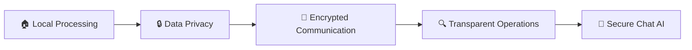

</div>

| Feature | Benefit | Implementation |
|---------|---------|----------------|
| 🏠 **Local Processing** | All computation stays local | No cloud dependencies |
| 🔒 **Data Privacy** | Data never leaves your network | Encrypted local storage |
| 🔐 **Encrypted Communication** | Secure inter-service communication | TLS/SSL protocols |
| 🔍 **Transparent Operations** | Open-source transparency | Full code visibility |
| 💬 **Secure Chat AI** | Family conversations stay private | Local LLM processing |

---

🔒 **Privacy-First:** All biometric processing remains local with medical-grade encryption.

---

<div align="center">

[](https://github.com/Logulokesh/KinAI-Ecosystem/graphs/contributors)

</div>

---

## 📄 License

Yep, it’s free — just like hugs 🤗, high-fives ✋, and a thumbs-up 👍!

---

<div align="center">

**Built with passion ❤️ for privacy, intelligence, and automation**

</div>
