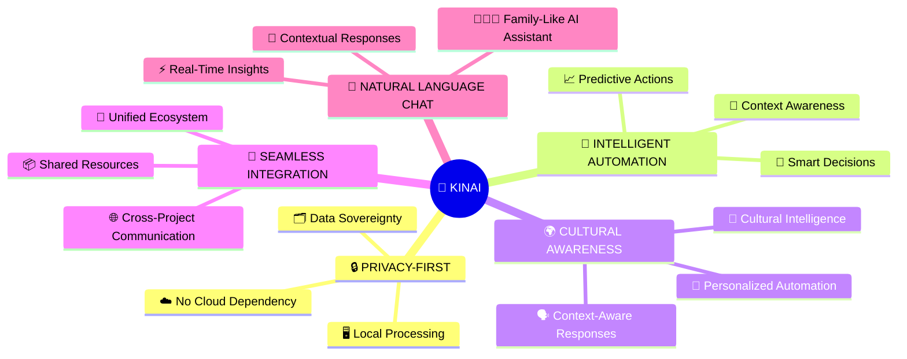
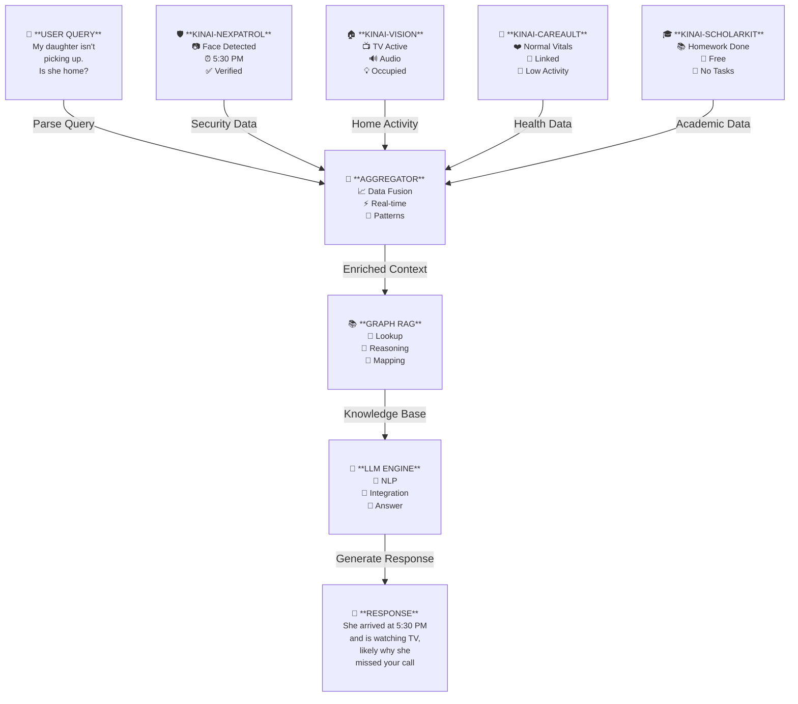
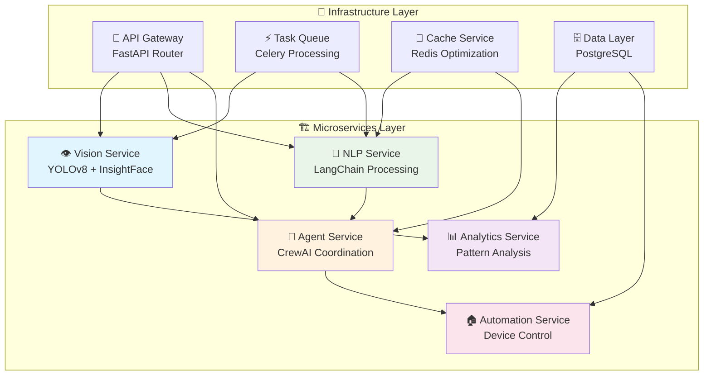
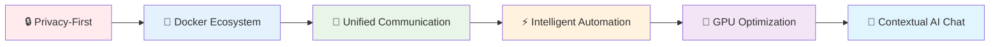
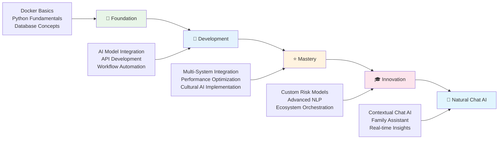
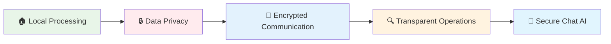

# 🤖 KinAI Ecosystem: Privacy-First AI Solutions for Smart Living

<div align="center">
<p align="center">
  
</p>

[](https://github.com/Logulokesh/KinAI-Ecosystem)
[](https://hub.docker.com/r/kinai/ecosystem)
[](LICENSE)
[](docs/privacy.md)

> **A comprehensive suite of interconnected AI-powered applications designed for secure, intelligent automation in healthcare, security, home management, and education.**

</div>

---

## 🎯 **KinAI Natural Language Chat: End Goal**


💬 Current Chat Examples

    "My daughter isn't picking up the phone, is she home?"
    → "She arrived home at 5:30 PM and is currently watching TV, which might explain why she missed your call."

KinAI aims to create a **family member-like AI** that acts as the first level of support for health, finance, well-being, and daily activity monitoring, keeping everyone informed with contextual awareness. By integrating data from **KinAI-Vision** (home activity), **KinAI-CareVault** (health and finance), **KinAI-NexPatrol** (security), **KinAI-ScholarKit** (education), and **KinAI-Mentor** (tutoring), the AI delivers **breakthrough contextual responses** to natural language queries.

This unified, natural language chat system leverages data on health, food preferences, education, and daily routines to provide personalized, privacy-first support for the entire family.

<div align="center">

### 🌟 **Key Achievement: Contextual Family Awareness**

</div>

<table>
<tr>
<td width="50%">

**🔍 Real-Time Intelligence**
- ✅ **Real-Time Tracking**: Monitors family locations and activities
- ✅ **Activity Insights**: Detects current activities (watching TV, studying, cooking)
- ✅ **Seamless Integration**: Combines data from all ecosystem projects
- ✅ **Privacy-First**: All processing happens locally

</td>
<td width="50%">

**💬 Natural Conversations**
- ✅ **Context-Aware Responses**: "She's watching TV, explaining the missed call"
- ✅ **Family-Centric Support**: Actionable insights for peace of mind
- ✅ **Trusted Assistant**: Human-like interactions with meaningful data
- ✅ **Enhanced Connectivity**: Strengthens family bonds through transparency

</td>
</tr>
</table>

<div align="center">

### 🚀 **This milestone showcases KinAI's ability to act as a trusted, intelligent family assistant, transforming raw data into meaningful, human-like interactions.**

</div>

---

### 🌟 Project Overview

We've mastered AI in boardrooms and data centers 🏢💻—building intelligent systems that predict market trends 📊, automate complex workflows ⚙️, and scale securely to millions of users, all while upholding strict privacy, compliance, and ethical guardrails 🔐.

Yet when we come home 🏠, we're met by 'smart' devices 🤖 that barely understand our routines, let alone our cultural values 🌏, emotional needs ❤️, or privacy concerns 🕵️‍♂️.

The KinAI ecosystem bridges this innovation gap 🌉, offering a holistic, privacy-focused approach to personal AI. By combining local processing 🧠 with intelligent automation 🔁, each KinAI project addresses real-world needs—from home security 🛡️ to health management 🩺—while ensuring seamless integration and data sovereignty 🗄️.

It's time personal AI caught up to enterprise standards 🚀.

<div align="center">

### 🎯 The Problem We Solve

</div>

<table>
<tr>
<td width="50%">

**🏢 Enterprise Reality**
- ✅ Predict market trends 📊
- ✅ Automate workflows ⚙️
- ✅ Scale to millions 🚀
- ✅ Privacy & compliance 🔐

</td>
<td width="50%">

**🏠 Home Reality**
- ❌ Basic 'smart' devices 🤖
- ❌ No cultural awareness 🌏
- ❌ No emotional intelligence ❤️
- ❌ Privacy concerns 🕵️‍♂️

</td>
</tr>
</table>

<div align="center">

### 🚀 **It's time personal AI caught up to enterprise standards**

</div>

---

## 🎯 Core Philosophy

<div align="center">



</div>

---

## 🔮 **Natural Language Chat Integration**

<div align="center">

### 🤖 **How KinAI Delivers Breakthrough Contextual Responses**

</div>



---

## 📋 Project Portfolio

<div align="center">

### 🏠 **Smart Home** • 🏥 **Healthcare** • 🛡️ **Security** • 🎓 **Education**

</div>

<details>
<summary><b>🏠 KinAI-Vision</b> - AI-driven microservices for intelligent home automation</summary>

<br>

**🔍 Problem Solved:** Lack of culturally aware, privacy-focused smart home automation

**🎯 Natural Language Chat Contribution:** Real-time activity detection and home automation status for contextual family insights.

<div align="center">



</div>

**🔧 Tech Stack:**
- 👁️ **Computer Vision:** YOLOv8, InsightFace
- 🧠 **AI Framework:** Ollama (LLM), LangChain (NLP), CrewAI
- 🗄️ **Database:** PostgreSQL, Redis
- 🏗️ **Architecture:** AI-Driven Microservices

**💡 Innovation:** AI-driven microservices with LangChain and CrewAI for scalable, culturally aware NLP experiences.

</details>

<details>
<summary><b>🏥 KinAI-CareVault</b> - Intelligent health & financial management system</summary>

<br>

**🔍 Problem Solved:** Complex, insecure management of personal health and financial records

**🎯 Natural Language Chat Contribution:** Health status monitoring, medication tracking, and financial insights for comprehensive family health awareness.

**🎯 Key Features:**
- 📄 **Intelligent Document Processing:** Automated classification and extraction
- 👨‍⚕️ **Family Health Management:** Comprehensive tracking
- 💰 **Financial Analytics:** Smart expense tracking
- 🔒 **Privacy-Focused:** Complete local processing

**🔧 Tech Stack:**
- 🧠 **AI:** Ollama (Local LLM)
- 🗄️ **Database:** PostgreSQL
- ⚡ **Automation:** n8n workflows
- 📋 **Tasks:** Vikunja
- 💬 **Interface:** Telegram Bot

**💡 Innovation:** Local LLM integration with robust database architecture for secure health and finance management.

</details>

<details>
<summary><b>🛡️ KinAI-NexPatrol</b> - AI-powered security & surveillance system</summary>

<br>

**🔍 Problem Solved:** Invasive, cloud-reliant home surveillance with inaccurate threat detection

**🎯 Natural Language Chat Contribution:** Face recognition for family member tracking, arrival/departure times, and location-based contextual responses.

<div align="center">

### 🎯 Risk Assessment Framework
*Inspired by Financial Crime Detection (AML Systems)*

| Risk Factor | High Risk | Medium Risk | Alert Level |
|-------------|-----------|-------------|-------------|
| 😷 Face Masks | +3 | +1 | Suspicious Concealment |
| 🧥 Hoodies | +4 | +2 | Identity Obscuration |
| 🔫 Weapons | +5 | +3 | Immediate Threat |
| 🌙 Nighttime | +2 | +1 | Temporal Risk |
| 🚫 Restricted Areas | +2 | +1 | Unauthorized Access |

**Alert Levels:** Low (0-2) • Medium (3-4) • High (5-6) • Very High (7-8) • Extreme (9+)

</div>

**🔧 Tech Stack:**
- 👁️ **Computer Vision:** YOLOv8, InsightFace
- 🧠 **AI Assessment:** Ollama (LLM)
- 🗄️ **Database:** SQLite
- 🖥️ **Processing:** NVIDIA GPU (CUDA)

**💡 Innovation:** Financial crime-inspired risk scoring with local AI processing for precise, privacy-first surveillance.

</details>

<details>
<summary><b>🎓 KinAI-ScholarKit</b> - LLM-powered curriculum-aligned educational activity generator</summary>

<br>

**🔍 Problem Solved:** Time-consuming search for curriculum-aligned, privacy-safe educational activities

**🎯 Natural Language Chat Contribution:** Educational progress tracking, homework completion status, and learning activity recommendations for family academic insights.

**🎯 Key Features:**
- 📚 **Curriculum-Aligned:** Victorian Curriculum F–10 Version 2.0
- 🔍 **RAG Pipeline:** FAISS vector search + knowledge graph
- 📄 **PDF Export:** Downloadable activities
- 🔒 **Privacy-Focused:** Fully offline processing

**🔧 Tech Stack:**
- 🧠 **AI:** Ollama (Local LLM)
- 🗄️ **Database:** FAISS, NetworkX
- 🖥️ **Interface:** Streamlit
- 📄 **Export:** ReportLab

**💡 Innovation:** Local LLM-driven educational platform with RAG pipeline for curriculum-aligned, privacy-first learning.

</details>

<details>
<summary><b>🎓 KinAI-Mentor</b> - Open-source, offline educational assistant</summary>

<br>

**🔍 Problem Solved:** Lack of accessible, personalized tutoring without internet dependency

**🎯 Natural Language Chat Contribution:** Personalized tutoring sessions, learning progress insights, and educational recommendations for comprehensive family learning support.

**🎯 Key Features:**
- 🎤 **Voice Interaction:** Speech-to-text and text-to-speech
- 📚 **Curriculum-Aligned:** Victorian Curriculum F–10 Version 2.0
- 🔒 **Privacy-Focused:** Fully offline processing
- ♿ **Accessible Design:** Multi-modal for diverse learners

**🔧 Tech Stack:**
- 🧠 **AI:** Ollama (Local LLM)
- 🗄️ **Database:** JSON knowledge base
- 🎤 **Voice:** Speech Recognition, TTS
- 🖥️ **Interface:** Streamlit

**💡 Innovation:** Voice-driven, offline AI tutor with multi-modal interaction for accessible, curriculum-driven learning.

</details>

---

## 🏗️ System Architecture

```mermaid
graph TB
    subgraph "💬 Natural Language Chat Hub"
        CHAT[🤖 KinAI Family Assistant<br/>Contextual AI Responses<br/>Privacy-First Processing]
    end
    
    subgraph "🤖 KinAI Ecosystem Overview"
        Core[🎯 Core Philosophy<br/>Privacy-First Local AI<br/>Intelligent Automation<br/>Cultural Awareness]
    end
    
    subgraph "🏥 KinAI-CareVault"
        CV_AI[🧠 Ollama LLM<br/>Document Classification<br/>Medical Recommendations]
        CV_DB[🗄️ PostgreSQL<br/>Medical Data<br/>Financial Records]
        CV_AUTO[⚡ n8n Workflows<br/>Task Automation]
        CV_BOT[💬 Telegram Bot<br/>User Interface]
    end
    
    subgraph "🛡️ KinAI-NexPatrol"
        NP_VISION[👁️ Computer Vision<br/>YOLOv8 Detection<br/>InsightFace Recognition]
        NP_AI[🧠 Ollama LLM<br/>Risk Assessment<br/>AML-Inspired Scoring]
        NP_AUTO[⚡ n8n Workflows<br/>Smart Notifications]
        NP_BOT[💬 Telegram Bot<br/>Alert System]
    end
    
    subgraph "🏠 KinAI-Vision"
        KV_VISION[👁️ Vision Service<br/>Real-time Detection]
        KV_NLP[🧠 NLP Service<br/>LangChain Processing]
        KV_AGENT[🤖 Agent Service<br/>CrewAI Coordination]
        KV_AUTO[🏠 Automation Service<br/>Device Control]
    end
    
    subgraph "🎓 Education Suite"
        SK_AI[📚 ScholarKit<br/>Curriculum Content]
        M_AI[🎓 Mentor<br/>Voice Tutoring]
    end
    
    subgraph "🔗 Integration Layer"
        TELEGRAM[💬 Unified Interface]
        N8N_MASTER[⚡ Master Automation Hub]
        GPU_SHARED[🖥️ Shared GPU Resources]
    end
    
    CHAT --> Core
    Core --> CV_AI
    Core --> NP_AI
    Core --> KV_NLP
    Core --> SK_AI
    Core --> M_AI
    
    CHAT --> CV_DB
    CHAT --> NP_VISION
    CHAT --> KV_VISION
    CHAT --> SK_AI
    CHAT --> M_AI
    
    TELEGRAM --> CV_BOT
    TELEGRAM --> NP_BOT
    TELEGRAM --> KV_AUTO
    TELEGRAM --> CHAT
    
    N8N_MASTER --> CV_AUTO
    N8N_MASTER --> NP_AUTO
    N8N_MASTER --> KV_AUTO
    
    GPU_SHARED --> NP_VISION
    GPU_SHARED --> KV_VISION
    GPU_SHARED --> SK_AI
    GPU_SHARED --> M_AI
    GPU_SHARED --> CHAT
    
    style CHAT fill:#e1f5fe,stroke:#0277bd,stroke-width:4px
    style Core fill:#e1f5fe,stroke:#0277bd,stroke-width:3px
    style CV_AI fill:#f3e5f5,stroke:#7b1fa2,stroke-width:2px
    style NP_AI fill:#e8f5e8,stroke:#388e3c,stroke-width:2px
    style KV_NLP fill:#fff3e0,stroke:#f57c00,stroke-width:2px
    style TELEGRAM fill:#fce4ec,stroke:#c2185b,stroke-width:2px
```

<div align="center">



</div>

---

## 🔗 System Integration & Synergy

<div align="center">

### 🔄 **Inter-Project Communication for Natural Language Chat**

</div>

| Integration | Natural Language Chat Benefit | Example Query & Response |
|-------------|-------------------------------|--------------------------|
| 🏥 Health + 🛡️ Security | Medical emergency with location context | **Q:** "Is dad okay?" **A:** "Dad took his medication at 8 AM and is currently in the garden." |
| 🛡️ Security + 🏠 Home | Visitor recognition with activity context | **Q:** "Who's at the door?" **A:** "Your neighbor Sarah is at the front door, and she visited last Tuesday." |
| 🏥 Health + 🏠 Home | Medication reminders with activity awareness | **Q:** "Did mom take her pills?" **A:** "Mom took her evening medication and is now reading in the bedroom." |
| 🎓 Education + 🏠 Home | Learning progress with family context | **Q:** "How's Emma's homework going?" **A:** "Emma completed her math homework and is currently practicing piano." |
| 🎓 Mentor + 📚 ScholarKit | Integrated tutoring with progress tracking | **Q:** "What should we focus on for study time?" **A:** "Based on recent performance, Emma needs help with fractions - I've prepared targeted exercises." |

<div align="center">

### 🏗️ **Natural Language Chat Infrastructure**



</div>

---

## 🚀 Getting Started

<div align="center">

### 📋 Prerequisites Checklist

</div>

<table>
<tr>
<td width="50%">

**🔧 Essential Requirements**
- ✅ Docker & Docker Compose
- ✅ NVIDIA GPU with CUDA support
- ✅ Python 3.9+
- ✅ Ollama server

</td>
<td width="50%">

**🎯 Optional Enhancements**
- ✅ Microphone and audio output
- ✅ Sufficient storage for LLM models
- ✅ High-speed internet (initial setup)
- ✅ Telegram Bot Token

</td>
</tr>
</table>

### ⚡ Quick Setup

<div align="center">

**🚀 One-Command Ecosystem Deployment**

</div>

```bash
# 1️⃣ Clone the ecosystem
git clone https://github.com/Logulokesh/KinAI-Vision.git
git clone https://github.com/Logulokesh/KinAI-CareVault.git
git clone https://github.com/Logulokesh/KinAI-NexPatrol.git
git clone https://github.com/Logulokesh/KinAI-ScholarKit.git
git clone https://github.com/Logulokesh/kinai-mentor.git

# 2️⃣ Configure environment
cp .env.example .env
# Edit .env with your configurations

# 3️⃣ Deploy with Docker
docker-compose up -d

# 4️⃣ Initialize AI models
docker exec -it kinai-ollama ollama pull llama3

# 5️⃣ Test Natural Language Chat
curl -X POST http://localhost:8080/chat \
  -H "Content-Type: application/json" \
  -d '{"query": "Is anyone home?"}'
```

---

## 📚 Learning Path

<div align="center">

### 🎯 **Current Focus: Agent2Agent (A2A) Protocol & Natural Language Chat Integration**
*Exploring advanced multi-agent system communication patterns for contextual family AI*

</div>



<details>
<summary><b>🌱 Beginner Level (Foundation)</b></summary>

- 🐳 **Docker basics:** Learn containerization and orchestration
- 🐍 **Python fundamentals:** Core programming for AI development
- 🗄️ **Database design:** Understand data schemas and queries
- ⚡ **Automation principles:** Basics of workflow automation

</details>

<details>
<summary><b>🚀 Intermediate Level (Development)</b></summary>

- 🧠 **AI model integration:** Integrate with Ollama and local LLMs
- 🔌 **API development:** Build APIs with FastAPI
- 🔄 **Workflow automation:** Create workflows with n8n
- 👁️ **Computer vision:** Explore vision basics with YOLOv8
- 🎤 **Speech processing:** Understand speech recognition

</details>

<details>
<summary><b>⭐ Advanced Level (Mastery)</b></summary>

- 🔗 **Multi-system integration:** Design integration patterns
- ⚡ **Performance optimization:** Optimize system performance
- 🌍 **Cultural intelligence:** Implement culturally aware AI
- 🏗️ **Microservices architecture:** Build scalable services
- 🎤 **Voice-driven interfaces:** Develop voice AI interfaces

</details>

<details>
<summary><b>🎓 Expert Level (Innovation)</b></summary>

- 🎯 **Custom AI models:** Develop risk assessment models
- 🧠 **Advanced NLP:** Leverage LangChain for NLP tasks
- 🎭 **Ecosystem orchestration:** Orchestrate complex systems
- 🔒 **Privacy-preserving AI:** Implement privacy-first AI
- 🤖 **Agent2Agent (A2A):** Develop multi-agent protocols

</details>

<details>
<summary><b>💬 Master Level (Natural Language Chat AI)</b></summary>

- 🤖 **Contextual AI Chat:** Build family-aware conversational AI
- 🔗 **Data Integration:** Seamlessly combine multi-project data
- 💬 **Natural Language Processing:** Advanced query understanding
- 🎯 **Real-time Insights:** Deliver meaningful, timely responses
- 👨‍👩‍👧‍👦 **Family Assistant:** Create trusted AI family member

</details>

---

## 💡 Innovation Highlights

<div align="center">

### 🏆 **What Makes KinAI Different**

</div>

<table>
<tr>
<td align="center" width="25%">

**💬 Natural Language AI**

🤖 Family-Like Assistant<br/>
🔍 Contextual Responses<br/>
🏠 Real-Time Family Insights

</td>
<td align="center" width="25%">

**🏥 Health AI Innovation**

🧠 Local Processing<br/>
🔍 Intelligent Classification<br/>
👨‍⚕️ Family Health Tracking

</td>
<td align="center" width="25%">

**🛡️ Security Intelligence**

⚖️ AML-Inspired Risk Scoring<br/>
👁️ Local Vision Processing<br/>
🎯 Smart Alert System

</td>
<td align="center" width="25%">

**🏠 AI-Driven Microservices**

🏗️ Scalable Architecture<br/>
🌍 Cultural Intelligence<br/>
🤖 Multi-Agent Coordination

</td>
</tr>
<tr>
<td align="center" width="25%">

**🔗 Unified Ecosystem**

🔄 Seamless Integration<br/>
🖥️ Shared GPU Resources<br/>
⚡ Centralized Automation

</td>
<td align="center" width="25%">

**📚 Education AI**

📖 Curriculum-Aligned Learning<br/>
🔍 RAG Pipeline Precision<br/>
🔒 Privacy-First Education

</td>
<td align="center" width="25%">

**🎓 Voice-Driven Education**

🎤 Multi-Modal Tutoring<br/>
♿ Accessible Design<br/>
📚 Curriculum Integration

</td>
<td align="center" width="25%">

**🎯 Breakthrough Achievement**

💬 Contextual Family Chat<br/>
🏠 Real-Time Activity Tracking<br/>
🔒 Privacy-First Intelligence

</td>
</tr>
</table>

---

## 🔐 Privacy & Security

<div align="center">



</div>

| Feature | Benefit | Implementation |
|---------|---------|----------------|
| 🏠 **Local Processing** | All computation stays local | No cloud dependencies |
| 🔒 **Data Privacy** | Data never leaves your network | Encrypted local storage |
| 🔐 **Encrypted Communication** | Secure inter-service communication | TLS/SSL protocols |
| 🔍 **Transparent Operations** | Open-source transparency | Full code visibility |
| 💬 **Secure Chat AI** | Family conversations stay private | Local LLM processing |

---

## 🚧 IN PROGRESS: Enhanced Health Intelligence

### 🏥 KinAI-CareVault Biometric Integration

Advancing from document management to comprehensive family health monitoring

🎯 **Current Development:** Integrating continuous biometric monitoring for deeper health context in natural language chat.

### 📊 New Biometric Capabilities

- 🩸 **Blood Glucose** - Continuous monitoring
- 😴 **Sleep Quality** - REM cycle analysis
- ❤️ **Heart Rate/HRV** - Stress detection
- 🫁 **SpO2** - Respiratory monitoring
- 🩺 **Blood Pressure** - Trend analysis

### 💬 Enhanced Chat Examples

**"How is Logu's health today?"**
→ *"Logu's glucose is 98 mg/dL (normal), she slept 7.5 hours with good REM cycles, and her heart rate is steady at 72 BPM. He's currently reading after taking his morning medication."*

### 🔗 Integration Benefits:

- **Predictive Health Insights** - Early anomaly detection
- **Activity Correlation** - Links health metrics with daily activities
- **Medication Effectiveness** - Tracks treatment response
- **Family Health Dashboard** - Comprehensive wellness overview

🔒 **Privacy-First:** All biometric processing remains local with medical-grade encryption.

---
🔒 Privacy-First: All biometric processing remains local with medical-grade encryption.

<div align="center">

[](https://github.com/Logulokesh/KinAI-Ecosystem/graphs/contributors)

</div>

---

## 📄 License

Each project maintains its own licensing model. Refer to individual repositories for specific license details.

---

## 🙏 Acknowledgments

<div align="center">

**Built with passion ❤️ for privacy, intelligence, and automation**

</div>

<table>
<tr>
<td align="center" width="25%">

