# 🤖 KinAI Ecosystem: Privacy-First AI Solutions for Smart Living


<div align="center">


> *A comprehensive suite of interconnected AI-powered applications designed for secure, intelligent automation in healthcare, security, and home management.*

</div>

---

## 🌟 Project Overview

We've mastered AI in boardrooms and data centers 🏢💻—building systems that predict market trends 📊, automate workflows ⚙️, and scale securely to millions, all while upholding strict privacy and compliance standards 🔐.

Yet when we come home 🏠, we're met by 'smart' devices 🤖 that barely understand our routines, let alone our cultural values 🌏, emotional needs ❤️, or privacy concerns 🕵️‍♂️.

The KinAI ecosystem bridges this innovation gap 🌉, offering a holistic, privacy-focused approach to personal AI. By combining local processing 🧠 with intelligent automation 🔁, each KinAI project addresses real-world needs—from home security 🛡️ to health management 🩺—while ensuring seamless integration and data sovereignty 🗄️.

It’s time personal AI caught up to enterprise standards 🚀.

### 🎯 Core Philosophy
- **🔒 Privacy-First**: All AI processing happens locally
- **🧠 Intelligent Automation**: Smart decision-making across all systems  
- **🌍 Cultural Awareness**: Context-aware responses and automation
- **🔗 Seamless Integration**: Unified ecosystem with cross-project communication

---

## 🏗️ System Architecture

```mermaid
graph TB
    subgraph "🤖 KinAI Ecosystem Overview"
        Core[🎯 Core Philosophy<br/>Privacy-First Local AI<br/>Intelligent Automation<br/>Cultural Awareness]
    end
    
    subgraph "🏥 KinAI-CareVault"
        CV_AI[🧠 Ollama LLM<br/>Document Classification<br/>Medical Recommendations]
        CV_DB[🗄️ PostgreSQL<br/>Medical Data<br/>Financial Records]
        CV_AUTO[⚡ n8n Workflows<br/>Task Automation]
        CV_TASK[📋 Vikunja<br/>Task Management<br/>Attachments]
        CV_BOT[💬 Telegram Bot<br/>User Interface]
        CV_DEPLOY[🚀 Docker Compose<br/>Container Orchestration]
        
        CV_AI --> CV_DB
        CV_DB --> CV_AUTO
        CV_AUTO --> CV_TASK
        CV_AUTO --> CV_BOT
        CV_DEPLOY --> CV_AI
        CV_DEPLOY --> CV_DB
    end
    
    subgraph "🛡️ KinAI-NexPatrol"
        NP_VISION[👁️ Computer Vision<br/>YOLOv8 Object Detection<br/>InsightFace Recognition]
        NP_AI[🧠 Ollama LLM<br/>Risk Assessment<br/>AML-Inspired Scoring]
        NP_DB[🗄️ SQLite<br/>Detection Logs<br/>Visitor Records]
        NP_AUTO[⚡ n8n Workflows<br/>Smart Notifications]
        NP_BOT[💬 Telegram Bot<br/>Alert System]
        NP_GPU[🖥️ NVIDIA GPU<br/>CUDA Processing]
        NP_DEPLOY[🚀 Docker Compose<br/>GPU Support]
        
        NP_VISION --> NP_AI
        NP_AI --> NP_DB
        NP_DB --> NP_AUTO
        NP_AUTO --> NP_BOT
        NP_GPU --> NP_VISION
        NP_GPU --> NP_AI
        NP_DEPLOY --> NP_VISION
        NP_DEPLOY --> NP_AI
    end
    
    subgraph "🏠 KinAI-Vision - AI-Driven Microservices"
        subgraph "🏗️ Microservices Layer"
            KV_VISION_SVC[👁️ Vision Service<br/>YOLOv8 + InsightFace<br/>Real-time Detection]
            KV_NLP_SVC[🧠 NLP Service<br/>LangChain Processing<br/>Context Understanding]
            KV_AGENT_SVC[🤖 Agent Service<br/>CrewAI Coordination<br/>Multi-Agent Responses]
            KV_ANALYTICS_SVC[📊 Analytics Service<br/>Pattern Analysis<br/>Behavioral Learning]
            KV_AUTO_SVC[🏠 Automation Service<br/>Device Control<br/>Environment Management]
        end
        
        subgraph "🔄 Infrastructure Layer"
            KV_GATEWAY[🚪 API Gateway<br/>FastAPI Router<br/>Load Balancer]
            KV_QUEUE[⚡ Task Queue<br/>Celery Processing<br/>Async Operations]
            KV_CACHE[💾 Cache Service<br/>Redis Optimization<br/>AI Response Cache]
            KV_DB[🗄️ Data Layer<br/>PostgreSQL<br/>Service Registry]
        end
        
        KV_HOME[🏠 External Integration<br/>Home Assistant<br/>Jellyfin Media]
        KV_AUTO[⚡ n8n Workflows<br/>Cultural Automation]
        KV_GPU[🖥️ NVIDIA GPU<br/>Distributed Processing]
        KV_DEPLOY[🚀 Docker Compose<br/>Microservices Orchestration]
        
        %% Service mesh connections
        KV_GATEWAY --> KV_VISION_SVC
        KV_GATEWAY --> KV_NLP_SVC
        KV_GATEWAY --> KV_AGENT_SVC
        
        KV_VISION_SVC --> KV_ANALYTICS_SVC
        KV_NLP_SVC --> KV_AGENT_SVC
        KV_AGENT_SVC --> KV_AUTO_SVC
        
        KV_QUEUE --> KV_VISION_SVC
        KV_QUEUE --> KV_NLP_SVC
        KV_QUEUE --> KV_ANALYTICS_SVC
        
        KV_CACHE --> KV_NLP_SVC
        KV_CACHE --> KV_AGENT_SVC
        
        KV_DB --> KV_ANALYTICS_SVC
        KV_DB --> KV_AUTO_SVC
        
        KV_AUTO_SVC --> KV_HOME
        KV_AUTO_SVC --> KV_AUTO
        
        KV_GPU --> KV_VISION_SVC
        KV_GPU --> KV_NLP_SVC
        KV_DEPLOY --> KV_GATEWAY
        KV_DEPLOY --> KV_QUEUE
    end
    
    subgraph "🔗 System Integration Layer"
        TELEGRAM[💬 Unified Telegram Interface<br/>Cross-System Communication]
        N8N_MASTER[⚡ Master n8n Hub<br/>Inter-Project Workflows]
        DOCKER_NETWORK[🐳 Docker Network<br/>Container Communication]
        GPU_SHARED[🖥️ Shared GPU Resources<br/>Optimized Processing]
        
        TELEGRAM --> CV_BOT
        TELEGRAM --> NP_BOT
        TELEGRAM --> KV_AUTO
        
        N8N_MASTER --> CV_AUTO
        N8N_MASTER --> NP_AUTO
        N8N_MASTER --> KV_AUTO
        
        DOCKER_NETWORK --> CV_DEPLOY
        DOCKER_NETWORK --> NP_DEPLOY
        DOCKER_NETWORK --> KV_DEPLOY
        
        GPU_SHARED --> NP_GPU
        GPU_SHARED --> KV_GPU
    end
    
    subgraph "📚 Key Learning Outcomes"
        LEARN_AI[🧠 AI/ML Mastery<br/>• Local LLM Integration<br/>• Computer Vision<br/>• NLP with LangChain<br/>• Multi-Agent Systems]
        
        LEARN_DATA[🗄️ Data Architecture<br/>• PostgreSQL Design<br/>• SQLite Optimization<br/>• Redis Caching<br/>• Schema Planning]
        
        LEARN_AUTOMATION[⚡ Automation Excellence<br/>• n8n Workflow Design<br/>• Docker Orchestration<br/>• API Integration<br/>• Event-Driven Systems]
        
        LEARN_SECURITY[🔒 Security & Privacy<br/>• Local Processing<br/>• Risk Assessment<br/>• Financial Crime Patterns<br/>• Data Protection]
        
        LEARN_INTEGRATION[🔗 System Integration<br/>• Microservices Architecture<br/>• Service Mesh Design<br/>• Cross-Platform APIs<br/>• Real-time Processing<br/>• Cultural Intelligence]
    end
    
    subgraph "🎯 Technical Progression Path"
        BEGINNER[🌱 Foundation<br/>Docker Basics<br/>Python Fundamentals<br/>Database Concepts]
        
        INTERMEDIATE[🚀 Development<br/>AI Model Integration<br/>API Development<br/>Workflow Automation]
        
        ADVANCED[⭐ Mastery<br/>Multi-System Integration<br/>Performance Optimization<br/>Cultural AI Implementation]
        
        EXPERT[🎓 Innovation<br/>Custom Risk Models<br/>Advanced NLP<br/>Ecosystem Orchestration]
        
        BEGINNER --> INTERMEDIATE
        INTERMEDIATE --> ADVANCED
        ADVANCED --> EXPERT
    end
    
    subgraph "💡 Innovation Highlights"
        INNOVATION1[🏥 Health AI<br/>Local LLM for<br/>Medical Classification]
        
        INNOVATION2[🛡️ Security Intelligence<br/>AML-Inspired Risk<br/>Assessment Framework]
        
        INNOVATION3[🏠 AI-Driven Microservices<br/>Scalable Service Mesh<br/>Cultural Home Automation]
        
        INNOVATION4[🔗 Unified Ecosystem<br/>Seamless Cross-Project<br/>Communication]
    end
    
    %% Core connections
    Core --> CV_AI
    Core --> NP_AI
    Core --> KV_NLP_SVC
    
    %% Learning outcome connections
    CV_AI --> LEARN_AI
    NP_VISION --> LEARN_AI
    KV_NLP_SVC --> LEARN_AI
    KV_AGENT_SVC --> LEARN_AI
    
    CV_DB --> LEARN_DATA
    NP_DB --> LEARN_DATA
    KV_DB --> LEARN_DATA
    
    CV_AUTO --> LEARN_AUTOMATION
    NP_AUTO --> LEARN_AUTOMATION
    KV_AUTO --> LEARN_AUTOMATION
    
    NP_AI --> LEARN_SECURITY
    CV_AI --> LEARN_SECURITY
    
    TELEGRAM --> LEARN_INTEGRATION
    N8N_MASTER --> LEARN_INTEGRATION
    KV_GATEWAY --> LEARN_INTEGRATION
    
    %% Innovation connections
    CV_AI --> INNOVATION1
    NP_AI --> INNOVATION2
    KV_GATEWAY --> INNOVATION3
    KV_AGENT_SVC --> INNOVATION3
    N8N_MASTER --> INNOVATION4
    
    %% Styling
    classDef aiNode fill:#e1f5fe,stroke:#0277bd,stroke-width:2px
    classDef dataNode fill:#f3e5f5,stroke:#7b1fa2,stroke-width:2px
    classDef autoNode fill:#e8f5e8,stroke:#388e3c,stroke-width:2px
    classDef integrationNode fill:#fff3e0,stroke:#f57c00,stroke-width:2px
    classDef learningNode fill:#fce4ec,stroke:#c2185b,stroke-width:2px
    classDef innovationNode fill:#f1f8e9,stroke:#689f38,stroke-width:2px
    
    class CV_AI,NP_AI,KV_NLP_SVC,KV_AGENT_SVC,NP_VISION,KV_VISION_SVC,LEARN_AI aiNode
    class CV_DB,NP_DB,KV_DB,KV_CACHE,LEARN_DATA dataNode
    class CV_AUTO,NP_AUTO,KV_AUTO,N8N_MASTER,KV_AUTO_SVC,LEARN_AUTOMATION autoNode
    class TELEGRAM,DOCKER_NETWORK,GPU_SHARED,KV_GATEWAY,KV_QUEUE,LEARN_INTEGRATION integrationNode
    class LEARN_AI,LEARN_DATA,LEARN_AUTOMATION,LEARN_SECURITY,LEARN_INTEGRATION learningNode
    class INNOVATION1,INNOVATION2,INNOVATION3,INNOVATION4 innovationNode
```



---

## 🏠 KinAI-Vision
*AI-Driven Microservices Architecture for Intelligent Home Automation*

[](https://github.com/Logulokesh/KinAI-Vision)

### 🔧 Tech Stack
- **👁️ Computer Vision**: YOLOv8, InsightFace
- **🧠 AI Framework**: Ollama (LLM), LangChain (NLP), CrewAI (Conversational AI)
- **🗄️ Database**: PostgreSQL, Redis (AI Cache)
- **🖥️ Processing**: Python 3.8+, OpenCV, FastAPI, Celery
- **⚡ Automation**: n8n, Home Assistant, Jellyfin
- **🏗️ Architecture**: AI-Driven Microservices with service mesh
- **🚀 Deployment**: Docker Compose with NVIDIA GPU (CUDA)

### 🎯 AI-Driven Microservices Architecture

#### 🏗️ Service Mesh Design
- **🎯 Vision Service**: Real-time object detection and face recognition
- **🧠 NLP Service**: LangChain-powered contextual understanding
- **🤖 Agent Service**: CrewAI coordination for multi-agent responses
- **📊 Analytics Service**: Behavioral pattern analysis and learning
- **🏠 Automation Service**: Device control and environment management
- **💾 Cache Service**: Redis-based AI response optimization
- **🔄 API Gateway**: FastAPI-based request routing and load balancing

#### 🔗 Inter-Service Communication
- **🚀 Async Processing**: Celery-based task queues for heavy AI workloads
- **📡 Event-Driven**: Real-time message passing between microservices
- **🔄 Service Discovery**: Dynamic service registration and health checks
- **⚖️ Load Balancing**: Intelligent request distribution across AI services
- **🛡️ Circuit Breakers**: Fault tolerance and graceful degradation

### 🎯 Advanced LLM Capabilities

#### 🔗 LangChain Integration
- **🎊 Contextual Greetings**: "Happy Diwali, Logu!" with cultural awareness
- **🔒 Secure NLP**: Local processing with Ollama for privacy

#### 🤝 CrewAI Coordination
- **👥 Multi-Agent System**: Human-like, mood-aware responses
- **🌡️ Environmental Awareness**: "Chilly evening, warming up the house!"
- **😊 Emotional Intelligence**: Adaptive communication based on user mood

#### 🎯 Cultural Intelligence Features
- **🎭 Festival Awareness**: Hindu calendar integration
- **🌦️ Contextual Responses**: Weather and time-based interactions
- **🎵 Personalized Automation**: Learning user preferences for lighting, climate, and music

### 💡 Key Innovation
AI-driven microservices architecture with LangChain and CrewAI integration delivers scalable, culturally aware NLP experiences, while distributed computer vision services enable truly personalized smart home automation with fault-tolerant, high-performance processing.

---

## 🏥 KinAI-CareVault
*Intelligent Health & Financial Management System*

[](https://github.com/Logulokesh/KinAI-CareVault)

### 🔧 Tech Stack
- **🧠 AI**: Ollama (Local LLM) for document classification & medical recommendations
- **🗄️ Database**: PostgreSQL for medical/financial data
- **⚡ Automation**: n8n for workflow orchestration
- **📋 Task Management**: Vikunja for tasks and attachments
- **💬 Interface**: Telegram Bot API
- **🚀 Deployment**: Docker Compose

### 🎯 Key Features
- **📄 Intelligent Document Processing**: Automated classification and detail extraction
- **👨‍⚕️ Family Health Management**: Comprehensive tracking of conditions, medications, and allergies
- **💰 Financial Analytics**: Smart expense tracking with vendor and amount extraction
- **🔒 Privacy-Focused**: Complete local processing for maximum data security

### 💡 Key Innovation
Local LLM integration with robust database architecture enables secure, user-friendly health and finance management through precise schema design.

---

## 🛡️ KinAI-NexPatrol
*AI-Powered Security & Surveillance System*

[](https://github.com/Logulokesh/KinAI-NexPatrol)

### 🔧 Tech Stack
- **👁️ Computer Vision**: YOLOv8 (Object Detection), InsightFace (Face Recognition)
- **🧠 AI Assessment**: Ollama (LLM) for intelligent risk evaluation
- **🗄️ Database**: SQLite for detection logs and visitor records
- **⚡ Automation**: n8n for smart notifications
- **💬 Interface**: Telegram Bot API
- **🖥️ Processing**: Python 3.8+, OpenCV
- **🚀 Deployment**: Docker Compose with NVIDIA GPU (CUDA)

### 🎯 Risk Assessment Framework
*Inspired by Financial Crime Detection (AML Systems)*

| Risk Factor | High Risk | Medium Risk | Alert Level |
|-------------|-----------|-------------|-------------|
| 😷 Face Masks | +3 | +1 | Suspicious Concealment |
| 🧥 Hoodies | +4 | +2 | Identity Obscuration |
| 🔫 Weapons | +5 | +3 | Immediate Threat |
| 🌙 Nighttime | +2 | +1 | Temporal Risk |
| 🚫 Restricted Areas | +2 | +1 | Unauthorized Access |

**Alert Levels**: Low (0-2) • Medium (3-4) • High (5-6) • Very High (7-8) • Extreme (9+)

### 💡 Key Innovation
Financial crime-inspired risk scoring combined with local AI processing delivers precise, privacy-first surveillance with minimal false positives.

---

## 🏠 KinAI-Vision

---

## 🔗 System Integration & Architecture

### 🏗️ Common Infrastructure
- **🔒 Privacy-First Design**: All AI processing happens locally
- **🐳 Docker Ecosystem**: Consistent deployment across all projects
- **💬 Unified Communication**: Telegram Bot API for seamless interaction
- **⚡ Intelligent Automation**: n8n workflows connecting all systems
- **🎯 GPU Optimization**: NVIDIA CUDA acceleration for real-time processing

### 🔄 Inter-Project Synergy
1. **Health + Security**: Medical emergency detection triggers NexPatrol alerts
2. **Security + Home**: Visitor recognition enables personalized environment adjustment
3. **Health + Home**: Medication reminders integrated with smart lighting
4. **All Systems**: Unified notification system through Telegram

---

## 🚀 Getting Started

### 📋 Prerequisites
- Docker & Docker Compose
- NVIDIA GPU with CUDA support
- Python 3.8+
- Sufficient storage for local LLM models

### ⚡ Quick Setup

1. **Clone the ecosystem repositories**
   ```bash
   git clone https://github.com/Logulokesh/KinAI-Vision.git
   git clone https://github.com/Logulokesh/KinAI-CareVault.git
   git clone https://github.com/Logulokesh/KinAI-NexPatrol.git
   ```

2. **Configure environment variables**
   ```bash
   cp .env.example .env
   # Edit .env with your configurations
   ```

3. **Deploy with Docker Compose**
   ```bash
   # For each project
   docker-compose up -d
   ```

4. **Initialize AI models**
   ```bash
   # Download required models
   docker exec -it kinai-ollama ollama pull llama2
   ```

### 🔧 Configuration

Each project includes comprehensive Docker Compose configurations for easy deployment. GPU setup is essential for optimal performance.

---

## 📚 Learning Path

### 🎯 Current Focus: Agent2Agent (A2A) Protocol
Exploring advanced multi-agent communication patterns and inter-service AI coordination for seamless ecosystem integration.

### 🌱 Beginner (Foundation)
- Docker basics and containerization
- Python fundamentals for AI
- Database design concepts
- Basic automation principles

### 🚀 Intermediate (Development)
- AI model integration with Ollama
- API development with FastAPI
- Workflow automation with n8n
- Computer vision basics

### ⭐ Advanced (Mastery)
- Multi-system integration patterns
- Performance optimization techniques
- Cultural AI implementation
- Microservices architecture

### 🎓 Expert (Innovation)
- Custom risk assessment models
- Advanced NLP with LangChain
- Ecosystem orchestration
- Privacy-preserving AI techniques
- **Agent2Agent (A2A) Protocol**: Multi-agent communication frameworks

---

## 💡 Innovation Highlights

### 🏥 Health AI Innovation
- **Local LLM Processing**: Complete privacy for medical data
- **Intelligent Classification**: Automated document processing
- **Family Health Tracking**: Comprehensive medical management

### 🛡️ Security Intelligence
- **AML-Inspired Risk Assessment**: Financial crime detection patterns
- **Local Computer Vision**: Privacy-first surveillance
- **Smart Alert System**: Reduced false positives

### 🏠 AI-Driven Microservices
- **Scalable Service Mesh**: Fault-tolerant architecture
- **Cultural Intelligence**: Context-aware automation
- **Multi-Agent Coordination**: CrewAI integration

### 🔗 Unified Ecosystem
- **Seamless Communication**: Cross-project integration
- **Shared Resources**: Optimized GPU utilization
- **Centralized Control**: Master automation hub

---

## 🔐 Privacy & Security

- **🏠 Local Processing**: All AI computation happens on your hardware
- **🔒 Data Sovereignty**: Your data never leaves your network
- **🛡️ Encrypted Communication**: Secure inter-service communication
- **🔍 Transparent Operations**: Open-source architecture for full visibility

---

## 🤝 Contributing

This ecosystem thrives on community contributions! Here's how you can help:

### 🎯 Areas for Contribution
- **🧠 AI Model Enhancement**: Improve local LLM implementations
- **⚡ Automation Workflows**: Create new n8n integrations
- **🏗️ Architecture**: Optimize microservices performance
- **📱 User Interface**: Enhance Telegram bot experiences
- **🔒 Security**: Strengthen privacy and security measures

### 🚀 Getting Started
1. Fork the relevant repository
2. Create a feature branch
3. Make your changes with tests
4. Submit a pull request with detailed description

---

## 📄 License

Each project maintains its individual licensing. Please refer to respective repositories for specific license information.

---

## 🙏 Acknowledgments

Built with love for privacy, intelligence, and seamless automation. Special thanks to:

- **Open Source AI Community**: Making local AI accessible
- **Docker Community**: Simplified deployment and scaling
- **n8n Team**: Powerful workflow automation
- **Ollama Project**: Local LLM capabilities
- **YOLOv8 & InsightFace**: Computer vision excellence

---

## 📞 Support & Community

- **📧 Issues**: Use GitHub Issues for bug reports and feature requests
- **💬 Discussions**: Join our community discussions
- **📖 Documentation**: Comprehensive guides in each repository
- **🔧 Support**: Community-driven support through GitHub

---

<div align="center">

**🔮 The future of smart living is private, intelligent, and culturally aware.**

---

Made with ❤️ by the KinAI Community

[](https://github.com/Logulokesh/KinAI-Vision)
[](https://github.com/Logulokesh)

</div>
