```mermaid
graph TB
    subgraph "🏗️ Microservices Layer"
        A[👁️ Vision Service<br/>YOLOv8 + InsightFace]
        B[🧠 NLP Service<br/>LangChain Processing]
        C[🤖 Agent Service<br/>CrewAI Coordination]
        D[📊 Analytics Service<br/>Pattern Analysis]
        E[🏠 Automation Service<br/>Device Control]
    end
    
    subgraph "🔄 Infrastructure Layer"
        F[🚪 API Gateway<br/>FastAPI Router]
        G[⚡ Task Queue<br/>Celery Processing]
        H[💾 Cache Service<br/>Redis Optimization]
        I[🗄️ Data Layer<br/>PostgreSQL]
    end
    
    A --> D
    B --> C
    C --> E
    F --> A
    F --> B
    F --> C
    G --> A
    G --> B
    H --> B
    H --> C
    I --> D
    I --> E
    
    style A fill:#e1f5fe
    style B fill:#e8f5e8
    style C fill:#fff3e0
    style D fill:#f3e5f5
    style E fill:#fce4ec
```

# 🤖 KinAI Ecosystem: Privacy-First AI Solutions for Smart Living

<div align="center">


[](https://github.com/Logulokesh/KinAI-Ecosystem)
[](https://hub.docker.com/r/kinai/ecosystem)
[](LICENSE)
[](docs/privacy.md)

> **A comprehensive suite of interconnected AI-powered applications designed for secure, intelligent automation in healthcare, security, home management, and education.**

</div>

### 🌟 Project Overview

We've mastered AI in boardrooms and data centers 🏢💻—building systems that predict market trends 📊, automate workflows ⚙️, and scale securely to millions, all while upholding strict privacy and compliance standards 🔐.

Yet when we come home 🏠, we're met by 'smart' devices 🤖 that barely understand our routines, let alone our cultural values 🌏, emotional needs ❤️, or privacy concerns 🕵️‍♂️.

The KinAI ecosystem bridges this innovation gap 🌉, offering a holistic, privacy-focused approach to personal AI. By combining local processing 🧠 with intelligent automation 🔁, each KinAI project addresses real-world needs—from home security 🛡️ to health management 🩺—while ensuring seamless integration and data sovereignty 🗄️.

It’s time personal AI caught up to enterprise standards 🚀.

<div align="center">

### 🎯 The Problem We Solve

</div>

<table>
<tr>
<td width="50%">

**🏢 Enterprise Reality**
- ✅ Predict market trends 📊
- ✅ Automate workflows ⚙️
- ✅ Scale to millions 🚀
- ✅ Privacy & compliance 🔐

</td>
<td width="50%">

**🏠 Home Reality**
- ❌ Basic 'smart' devices 🤖
- ❌ No cultural awareness 🌏
- ❌ No emotional intelligence ❤️
- ❌ Privacy concerns 🕵️‍♂️

</td>
</tr>
</table>

<div align="center">

### 🚀 **It's time personal AI caught up to enterprise standards**

</div>

---

## 🎯 Core Philosophy

```mermaid
mindmap
  root((🎯 KinAI Core))
    🔒 Privacy-First
      Local Processing
      No Cloud Dependency
      Data Sovereignty
    🧠 Intelligent Automation
      Smart Decisions
      Context Awareness
      Predictive Actions
    🌍 Cultural Awareness
      Context-Aware Responses
      Cultural Intelligence
      Personalized Automation
    🔗 Seamless Integration
      Unified Ecosystem
      Cross-Project Communication
      Shared Resources
```

<div align="center">



</div>

---

## 📋 Project Portfolio

<div align="center">

### 🏠 **Smart Home** • 🏥 **Healthcare** • 🛡️ **Security** • 🎓 **Education**

</div>

<details>
<summary><b>🏠 KinAI-Vision</b> - AI-driven microservices for intelligent home automation</summary>

<br>

**🔍 Problem Solved:** Lack of culturally aware, privacy-focused smart home automation

<div align="center">



</div>

**🔧 Tech Stack:**
- 👁️ **Computer Vision:** YOLOv8, InsightFace
- 🧠 **AI Framework:** Ollama (LLM), LangChain (NLP), CrewAI
- 🗄️ **Database:** PostgreSQL, Redis
- 🏗️ **Architecture:** AI-Driven Microservices

**💡 Innovation:** AI-driven microservices with LangChain and CrewAI for scalable, culturally aware NLP experiences.

</details>

<details>
<summary><b>🏥 KinAI-CareVault</b> - Intelligent health & financial management system</summary>

<br>

**🔍 Problem Solved:** Complex, insecure management of personal health and financial records

**🎯 Key Features:**
- 📄 **Intelligent Document Processing:** Automated classification and extraction
- 👨‍⚕️ **Family Health Management:** Comprehensive tracking
- 💰 **Financial Analytics:** Smart expense tracking
- 🔒 **Privacy-Focused:** Complete local processing

**🔧 Tech Stack:**
- 🧠 **AI:** Ollama (Local LLM)
- 🗄️ **Database:** PostgreSQL
- ⚡ **Automation:** n8n workflows
- 📋 **Tasks:** Vikunja
- 💬 **Interface:** Telegram Bot

**💡 Innovation:** Local LLM integration with robust database architecture for secure health and finance management.

</details>

<details>
<summary><b>🛡️ KinAI-NexPatrol</b> - AI-powered security & surveillance system</summary>

<br>

**🔍 Problem Solved:** Invasive, cloud-reliant home surveillance with inaccurate threat detection

<div align="center">

### 🎯 Risk Assessment Framework
*Inspired by Financial Crime Detection (AML Systems)*

| Risk Factor | High Risk | Medium Risk | Alert Level |
|-------------|-----------|-------------|-------------|
| 😷 Face Masks | +3 | +1 | Suspicious Concealment |
| 🧥 Hoodies | +4 | +2 | Identity Obscuration |
| 🔫 Weapons | +5 | +3 | Immediate Threat |
| 🌙 Nighttime | +2 | +1 | Temporal Risk |
| 🚫 Restricted Areas | +2 | +1 | Unauthorized Access |

**Alert Levels:** Low (0-2) • Medium (3-4) • High (5-6) • Very High (7-8) • Extreme (9+)

</div>

**🔧 Tech Stack:**
- 👁️ **Computer Vision:** YOLOv8, InsightFace
- 🧠 **AI Assessment:** Ollama (LLM)
- 🗄️ **Database:** SQLite
- 🖥️ **Processing:** NVIDIA GPU (CUDA)

**💡 Innovation:** Financial crime-inspired risk scoring with local AI processing for precise, privacy-first surveillance.

</details>

<details>
<summary><b>🎓 KinAI-ScholarKit</b> - LLM-powered curriculum-aligned educational activity generator</summary>

<br>

**🔍 Problem Solved:** Time-consuming search for curriculum-aligned, privacy-safe educational activities

**🎯 Key Features:**
- 📚 **Curriculum-Aligned:** Victorian Curriculum F–10 Version 2.0
- 🔍 **RAG Pipeline:** FAISS vector search + knowledge graph
- 📄 **PDF Export:** Downloadable activities
- 🔒 **Privacy-Focused:** Fully offline processing

**🔧 Tech Stack:**
- 🧠 **AI:** Ollama (Local LLM)
- 🗄️ **Database:** FAISS, NetworkX
- 🖥️ **Interface:** Streamlit
- 📄 **Export:** ReportLab

**💡 Innovation:** Local LLM-driven educational platform with RAG pipeline for curriculum-aligned, privacy-first learning.

</details>

<details>
<summary><b>🎓 KinAI-Mentor</b> - Open-source, offline educational assistant</summary>

<br>

**🔍 Problem Solved:** Lack of accessible, personalized tutoring without internet dependency

**🎯 Key Features:**
- 🎤 **Voice Interaction:** Speech-to-text and text-to-speech
- 📚 **Curriculum-Aligned:** Victorian Curriculum F–10 Version 2.0
- 🔒 **Privacy-Focused:** Fully offline processing
- ♿ **Accessible Design:** Multi-modal for diverse learners

**🔧 Tech Stack:**
- 🧠 **AI:** Ollama (Local LLM)
- 🗄️ **Database:** JSON knowledge base
- 🎤 **Voice:** Speech Recognition, TTS
- 🖥️ **Interface:** Streamlit

**💡 Innovation:** Voice-driven, offline AI tutor with multi-modal interaction for accessible, curriculum-driven learning.

</details>

---

## 🏗️ System Architecture

```mermaid
graph TB
    subgraph "🤖 KinAI Ecosystem Overview"
        Core[🎯 Core Philosophy<br/>Privacy-First Local AI<br/>Intelligent Automation<br/>Cultural Awareness]
    end
    
    subgraph "🏥 KinAI-CareVault"
        CV_AI[🧠 Ollama LLM<br/>Document Classification<br/>Medical Recommendations]
        CV_DB[🗄️ PostgreSQL<br/>Medical Data<br/>Financial Records]
        CV_AUTO[⚡ n8n Workflows<br/>Task Automation]
        CV_BOT[💬 Telegram Bot<br/>User Interface]
    end
    
    subgraph "🛡️ KinAI-NexPatrol"
        NP_VISION[👁️ Computer Vision<br/>YOLOv8 Detection<br/>InsightFace Recognition]
        NP_AI[🧠 Ollama LLM<br/>Risk Assessment<br/>AML-Inspired Scoring]
        NP_AUTO[⚡ n8n Workflows<br/>Smart Notifications]
        NP_BOT[💬 Telegram Bot<br/>Alert System]
    end
    
    subgraph "🏠 KinAI-Vision"
        KV_VISION[👁️ Vision Service<br/>Real-time Detection]
        KV_NLP[🧠 NLP Service<br/>LangChain Processing]
        KV_AGENT[🤖 Agent Service<br/>CrewAI Coordination]
        KV_AUTO[🏠 Automation Service<br/>Device Control]
    end
    
    subgraph "🎓 Education Suite"
        SK_AI[📚 ScholarKit<br/>Curriculum Content]
        M_AI[🎓 Mentor<br/>Voice Tutoring]
    end
    
    subgraph "🔗 Integration Layer"
        TELEGRAM[💬 Unified Interface]
        N8N_MASTER[⚡ Master Automation Hub]
        GPU_SHARED[🖥️ Shared GPU Resources]
    end
    
    Core --> CV_AI
    Core --> NP_AI
    Core --> KV_NLP
    Core --> SK_AI
    Core --> M_AI
    
    TELEGRAM --> CV_BOT
    TELEGRAM --> NP_BOT
    TELEGRAM --> KV_AUTO
    
    N8N_MASTER --> CV_AUTO
    N8N_MASTER --> NP_AUTO
    N8N_MASTER --> KV_AUTO
    
    GPU_SHARED --> NP_VISION
    GPU_SHARED --> KV_VISION
    GPU_SHARED --> SK_AI
    GPU_SHARED --> M_AI
    
    style Core fill:#e1f5fe,stroke:#0277bd,stroke-width:3px
    style CV_AI fill:#f3e5f5,stroke:#7b1fa2,stroke-width:2px
    style NP_AI fill:#e8f5e8,stroke:#388e3c,stroke-width:2px
    style KV_NLP fill:#fff3e0,stroke:#f57c00,stroke-width:2px
    style TELEGRAM fill:#fce4ec,stroke:#c2185b,stroke-width:2px
```

<div align="center">



</div>

---

## 🔗 System Integration & Synergy

<div align="center">

### 🔄 **Inter-Project Communication**

</div>

| Integration | Benefit | Example |
|-------------|---------|---------|
| 🏥 Health + 🛡️ Security | Medical emergency detection | Triggers NexPatrol alerts |
| 🛡️ Security + 🏠 Home | Visitor recognition | Personalized automation |
| 🏥 Health + 🏠 Home | Medication management | Smart reminders |
| 🎓 Education + 🏠 Home | Learning activities | Automated scheduling |
| 🎓 Mentor + 📚 ScholarKit | Smart tutoring | Integrated learning flow |

<div align="center">

### 🏗️ **Common Infrastructure**

```mermaid
graph LR
    A[🔒 Privacy-First] --> B[🐳 Docker Ecosystem]
    B --> C[💬 Unified Communication]
    C --> D[⚡ Intelligent Automation]
    D --> E[🎯 GPU Optimization]
    
    style A fill:#ffebee
    style B fill:#e3f2fd
    style C fill:#e8f5e8
    style D fill:#fff3e0
    style E fill:#f3e5f5
```



</div>

---

## 🚀 Getting Started

<div align="center">

### 📋 Prerequisites Checklist

</div>

<table>
<tr>
<td width="50%">

**🔧 Essential Requirements**
- ✅ Docker & Docker Compose
- ✅ NVIDIA GPU with CUDA support
- ✅ Python 3.9+
- ✅ Ollama server

</td>
<td width="50%">

**🎯 Optional Enhancements**
- ✅ Microphone and audio output
- ✅ Sufficient storage for LLM models
- ✅ High-speed internet (initial setup)
- ✅ Telegram Bot Token

</td>
</tr>
</table>

### ⚡ Quick Setup

<div align="center">

**🚀 One-Command Ecosystem Deployment**

</div>

```bash
# 1️⃣ Clone the ecosystem
git clone https://github.com/Logulokesh/KinAI-Vision.git
git clone https://github.com/Logulokesh/KinAI-CareVault.git
git clone https://github.com/Logulokesh/KinAI-NexPatrol.git
git clone https://github.com/Logulokesh/KinAI-ScholarKit.git
git clone https://github.com/Logulokesh/kinai-mentor.git

# 2️⃣ Configure environment
cp .env.example .env
# Edit .env with your configurations

# 3️⃣ Deploy with Docker
docker-compose up -d

# 4️⃣ Initialize AI models
docker exec -it kinai-ollama ollama pull llama3
```

---

## 📚 Learning Path

<div align="center">

### 🎯 **Current Focus: Agent2Agent (A2A) Protocol**
*Exploring advanced multi-agent system communication patterns*

```mermaid
graph LR
    A[🌱 Foundation] --> B[🚀 Development]
    B --> C[⭐ Mastery]
    C --> D[🎓 Innovation]
    
    A1[Docker Basics<br/>Python Fundamentals<br/>Database Concepts] --> A
    B1[AI Model Integration<br/>API Development<br/>Workflow Automation] --> B
    C1[Multi-System Integration<br/>Performance Optimization<br/>Cultural AI Implementation] --> C
    D1[Custom Risk Models<br/>Advanced NLP<br/>Ecosystem Orchestration] --> D
    
    style A fill:#e8f5e8
    style B fill:#e3f2fd
    style C fill:#fff3e0
    style D fill:#fce4ec
```

</div>



<details>
<summary><b>🌱 Beginner Level (Foundation)</b></summary>

- 🐳 **Docker basics:** Learn containerization and orchestration
- 🐍 **Python fundamentals:** Core programming for AI development
- 🗄️ **Database design:** Understand data schemas and queries
- ⚡ **Automation principles:** Basics of workflow automation

</details>

<details>
<summary><b>🚀 Intermediate Level (Development)</b></summary>

- 🧠 **AI model integration:** Integrate with Ollama and local LLMs
- 🔌 **API development:** Build APIs with FastAPI
- 🔄 **Workflow automation:** Create workflows with n8n
- 👁️ **Computer vision:** Explore vision basics with YOLOv8
- 🎤 **Speech processing:** Understand speech recognition

</details>

<details>
<summary><b>⭐ Advanced Level (Mastery)</b></summary>

- 🔗 **Multi-system integration:** Design integration patterns
- ⚡ **Performance optimization:** Optimize system performance
- 🌍 **Cultural intelligence:** Implement culturally aware AI
- 🏗️ **Microservices architecture:** Build scalable services
- 🎤 **Voice-driven interfaces:** Develop voice AI interfaces

</details>

<details>
<summary><b>🎓 Expert Level (Innovation)</b></summary>

- 🎯 **Custom AI models:** Develop risk assessment models
- 🧠 **Advanced NLP:** Leverage LangChain for NLP tasks
- 🎭 **Ecosystem orchestration:** Orchestrate complex systems
- 🔒 **Privacy-preserving AI:** Implement privacy-first AI
- 🤖 **Agent2Agent (A2A):** Develop multi-agent protocols

</details>

---

## 💡 Innovation Highlights

<div align="center">

### 🏆 **What Makes KinAI Different**

</div>

<table>
<tr>
<td align="center" width="33%">

**🏥 Health AI Innovation**

🧠 Local Processing<br/>
🔍 Intelligent Classification<br/>
👨‍⚕️ Family Health Tracking

</td>
<td align="center" width="33%">

**🛡️ Security Intelligence**

⚖️ AML-Inspired Risk Scoring<br/>
👁️ Local Vision Processing<br/>
🎯 Smart Alert System

</td>
<td align="center" width="33%">

**🏠 AI-Driven Microservices**

🏗️ Scalable Architecture<br/>
🌍 Cultural Intelligence<br/>
🤖 Multi-Agent Coordination

</td>
</tr>
<tr>
<td align="center" width="33%">

**📚 Education AI**

📖 Curriculum-Aligned Learning<br/>
🔍 RAG Pipeline Precision<br/>
🔒 Privacy-First Education

</td>
<td align="center" width="33%">

**🎓 Voice-Driven Education**

🎤 Multi-Modal Tutoring<br/>
♿ Accessible Design<br/>
📚 Curriculum Integration

</td>
<td align="center" width="33%">

**🔗 Unified Ecosystem**

🔄 Seamless Integration<br/>
🖥️ Shared GPU Resources<br/>
⚡ Centralized Automation

</td>
</tr>
</table>

---

## 🔐 Privacy & Security

```mermaid
graph LR
    A[🏠 Local Processing] --> B[🔒 Data Privacy]
    B --> C[🔐 Encrypted Communication]
    C --> D[🔍 Transparent Operations]
    
    style A fill:#e8f5e8
    style B fill:#ffebee
    style C fill:#e3f2fd
    style D fill:#fff3e0
```

<div align="center">



</div>

| Feature | Benefit | Implementation |
|---------|---------|----------------|
| 🏠 **Local Processing** | All computation stays local | No cloud dependencies |
| 🔒 **Data Privacy** | Data never leaves your network | Encrypted local storage |
| 🔐 **Encrypted Communication** | Secure inter-service communication | TLS/SSL protocols |
| 🔍 **Transparent Operations** | Open-source transparency | Full code visibility |

---

## 🤝 Contributing

<div align="center">

### 🌟 **This ecosystem thrives on community contributions!**

</div>

<table>
<tr>
<td width="50%">

**🎯 Areas for Contribution**
- 🧠 AI Model Enhancement
- ⚡ Automation Workflows
- 🏗️ Architecture Optimization
- 📱 UI/UX Enhancement
- 🔒 Security Features
- 🎤 Voice Features

</td>
<td width="50%">

**🚀 Getting Started**
1. 🍴 Fork the repository
2. 🌿 Create a feature branch
3. ✨ Make your changes
4. 🧪 Include tests
5. 📝 Submit detailed PR

</td>
</tr>
</table>

<div align="center">

[](https://github.com/Logulokesh/KinAI-Ecosystem/graphs/contributors)

</div>

---

## 📄 License

Each project maintains its own licensing model. Refer to individual repositories for specific license details.

---

## 🙏 Acknowledgments

<div align="center">

**Built with passion ❤️ for privacy, intelligence, and automation**

</div>

<table>
<tr>
<td align="center" width="25%">

**🧠 AI Frameworks**<br/>
Ollama Project<br/>
OpenAI Community<br/>
Hugging Face

</td>
<td align="center" width="25%">

**👁️ Computer Vision**<br/>
YOLOv8 Team<br/>
InsightFace Project<br/>
OpenCV Community

</td>
<td align="center" width="25%">

**⚡ Automation**<br/>
n8n Team<br/>
Docker Community<br/>
LangChain Project

</td>
<td align="center" width="25%">

**🎓 Education**<br/>
Victorian Curriculum<br/>
Streamlit Team<br/>
Open Source Community

</td>
</tr>
</table>

---

## 📞 Support & Community

<div align="center">

[](https://github.com/Logulokesh/KinAI-Ecosystem/issues)
[](https://github.com/Logulokesh/KinAI-Ecosystem/discussions)
[](docs/)

</div>

| Support Type | Link | Description |
|-------------|------|-------------|
| 🐛 **Bug Reports** | [GitHub Issues](https://github.com/Logulokesh/KinAI-Ecosystem/issues) | Report bugs or request features |
| 💬 **Discussions** | [GitHub Discussions](https://github.com/Logulokesh/KinAI-Ecosystem/discussions) | Join our vibrant community |
| 📖 **Documentation** | [Detailed Guides](docs/) | Comprehensive documentation |
| 🔧 **Support** | [Community Support](https://github.com/Logulokesh/KinAI-Ecosystem/discussions/categories/q-a) | Community-driven support |

---

<div align="center">

## 🔮 **The future of smart living and learning is private, intelligent, and culturally aware.**

### Made with ❤️ by the KinAI Community

---


**⭐ Star this repository if you find it helpful!**

</div>
